# AUTOSCIENTIST SPECIFICATION
## Canonical Autonomous AI Scientist Architecture & Scientific Reasoning Specification
**Dataset Genome Intelligence Layer — Series-A Research Grade**

---

| Metadata | Details |
| :--- | :--- |
| **Document Name** | AutoScientist Specification (`AUTOSCIENTIST_SPEC.md`) |
| **System Layer** | Dataset Genome Autonomous Intelligence & Reasoning Layer |
| **Specification Version** | `9.0.0-AUTOSCIENTIST-CANONICAL` |
| **Target Scale** | Production Series-A AI Lab Specification (OpenAI / DeepMind Architecture Standard) |
| **Parent Specifications** | `system_specification.md` (Project Spec), `enterprise_production_specification.md` (Enterprise Spec) |
| **Authors** | Principal AI Research Scientist, Staff AI Systems Architect, ML Research Engineer |
| **Status** | Canonical Technical Specification |

---

## SECTION 1: Executive Summary

### 1.1 What is an AutoScientist?
An **AutoScientist** is an autonomous, goal-directed AI system capable of conducting scientific research over a domain without human intervention. Rather than answering questions or executing fixed scripts, an AutoScientist formulates empirical observations, prioritizes research questions, synthesizes falsifiable hypotheses, plans controlled experiments, executes code transformations in isolated sandboxes, measures empirical outcomes, updates its Bayesian scientific memory, and autonomously iterates until optimal discovery or statistical convergence is achieved.

### 1.2 Why Dataset Genome Needs an AutoScientist
In Data-Centric AI (DCAI), optimizing datasets is fundamentally a scientific research problem. Tabular datasets contain complex, non-linear interactions, missingness mechanisms, statistical noise, and feature dependencies. Fixed rules or static preprocessing scripts cannot adapt to arbitrary dataset distributions. Dataset Genome requires an **AutoScientist** to serve as the autonomous cognitive engine that reasons about dataset vulnerabilities and iteratively evolves data artifacts toward Pareto optimality ($\Delta \text{Downstream Model F1} > 0 \land \Delta \text{Health Score} \ge 0$).

### 1.3 Differentiation from ChatGPT & Conversational LLMs
Conversational LLMs (e.g., ChatGPT, Claude) are uncalibrated, open-loop text generators. They lack:
- **Empirical Grounding**: They suggest code transformations based on probabilistic language associations without executing code or observing metric outcomes.
- **Stateful Scientific Memory**: They do not maintain persistent vector-graph experiment histories or track Bayesian confidence updates over past failures.
- **Closed-Loop Verification**: They cannot measure downstream machine learning cross-validation performance or rollback degraded dataset branches.

Dataset Genome's AutoScientist uses LLMs exclusively as narrow reasoning operators within a strict, closed-loop scientific feedback framework governed by deterministic code execution, AST validation, and empirical LightGBM/XGBoost benchmark evaluations.

### 1.4 Differentiation from AutoML Systems
Traditional AutoML platforms (H2O, Auto-sklearn, FLAML) perform hyperparameter tuning and Neural Architecture Search (NAS) over **immutable, static datasets**. They treat input data as an unalterable black box.

Dataset Genome's AutoScientist inverts this paradigm: it freezes model architectures and autonomously mutates the **dataset itself**. It optimizes feature representations, missing value distributions, outlier boundaries, and class balance through an iterative, hypothesis-driven evolutionary search space.

---

## SECTION 2: Scientific Philosophy

Dataset Genome strictly enforces the **Scientific Method Loop** as an immutable engineering state machine:

```
                          +-----------------------------------+
                          |     1. EMPIRICAL OBSERVATION      |
                          | (Sprint 2 Dataset Intelligence)   |
                          +-----------------------------------+
                                            |
                                            v
                          +-----------------------------------+
                          |    2. MULTI-CRITERIA RANKING      |
                          | (Prioritized Problem Queue)       |
                          +-----------------------------------+
                                            |
                                            v
                          +-----------------------------------+
                          |  3. SCIENTIFIC REASONING & MEMORY |
                          | (CoT & Vector-Graph Retrieval)    |
                          +-----------------------------------+
                                            |
                                            v
                          +-----------------------------------+
                          | 4. FALSIFIABLE HYPOTHESIS GEN     |
                          | (Pydantic Schema & Target Metric) |
                          +-----------------------------------+
                                            |
                                            v
                          +-----------------------------------+
                          | 5. CONFIDENCE & RISK ESTIMATION   |
                          | (Bayesian Prior & Leakage Check)  |
                          +-----------------------------------+
                                            |
                                            v
                          +-----------------------------------+
                          | 6. AST EXPERIMENT PLANNING & EXEC |
                          | (Subprocess Sandbox Execution)    |
                          +-----------------------------------+
                                            |
                                            v
                          +-----------------------------------+
                          | 7. CLOSED-LOOP GBDT EVALUATION    |
                          | (5-Fold CV & Metric Comparison)   |
                          +-----------------------------------+
                                            |
                                            v
                          +-----------------------------------+
                          | 8. MEMORY COMMIT & NOTEBOOK LOG   |
                          | (DAG Commit or Anti-Pattern Log)  |
                          +-----------------------------------+
                                            |
                                            +-------------------+ (Next Generation Iteration)
```

Every dataset mutation must be justified by an empirical observation, backed by a falsifiable hypothesis, tested in isolation, evaluated against held-out cross-validation folds, recorded in the Scientific Memory Engine, and documented in the Research Notebook.

---

## SECTION 3: Overall AI Architecture

```mermaid
graph TD
    RawData[Uploaded CSV Dataset D0] --> IntelEngine[Sprint 2 Intelligence Engine]
    IntelEngine --> GenomeReport[GenomeReportResponse JSON]
    
    subgraph AutoScientist Intelligence Layer
        GenomeReport --> ObsEngine[Module 1: Observation Engine]
        ObsEngine --> RankEngine[Module 2: Problem Ranking Engine]
        RankEngine --> SciMem[Module 4: Scientific Memory Engine]
        
        RankEngine --> ReasonEngine[Module 3: Reasoning Engine CoT]
        SciMem <-->|Query Recipes & Anti-Patterns| ReasonEngine
        
        ReasonEngine --> HypoGen[Module 5: Hypothesis Generator]
        HypoGen --> ConfEngine[Module 7: Confidence Engine]
        
        ConfEngine -->|Approved c >= 0.60| ExpPlanner[Module 6: Experiment Planner]
        ConfEngine -.->|Rejected c < 0.60| Notebook[Module 10: Research Notebook]
        
        ExpPlanner --> ExecInterface[Module 8: Execution Interface]
        ExecInterface --> Sandbox[Subprocess Execution Sandbox]
        Sandbox --> MutatedCSV[Mutated Dataset D_k]
        
        MutatedCSV --> EvalEngine[Module 9: Evaluation Engine]
        EvalEngine -->|5-Fold CV GBDT Benchmark| Decision{Accept or Reject?}
        
        Decision -->|ACCEPT F(D_k) > F(D_base)| CommitDAG[Dataset Lineage System DAG Node]
        Decision -->|REJECT F(D_k) <= F(D_base)| RollbackDAG[DAG Rollback to Baseline]
        
        CommitDAG --> LearnLoop[Module 11: Learning Loop & Bayesian Update]
        RollbackDAG --> LearnLoop
        
        LearnLoop --> SciMem
        LearnLoop --> Notebook
    end

    LearnLoop -->|Next Iteration Trigger| IntelEngine
```

---

## SECTION 4: Observation Engine

### 4.1 Responsibilities
Ingests raw `GenomeReportResponse` JSON from the Sprint 2 Dataset Intelligence Engine, detects statistical abnormalities across all 6 profiling axes (Completeness, Consistency, Balance, Noise, Correlation, Feature Quality), calculates empirical severity scores, and outputs structured, standardized `ScientificObservation` objects.

### 4.2 Inputs
- `report: GenomeReportResponse` (Pydantic schema from Sprint 2)
- `metadata: DatasetMetadata` (row count, column count, target column name)

### 4.3 Outputs
- `observations: List[ScientificObservation]`

### 4.4 Internal Algorithms
1. **Vectorized Anomaly Scanning**: Sweeps metric fields in `GenomeReportResponse`.
2. **Severity Calibration Algorithm**:
   $$\text{Severity}(O_i) = \min\left(1.0, \frac{|\text{ObservedMetric} - \text{Threshold}|}{\text{Threshold}}\right) \times w_{\text{category}}$$
   Where $w_{\text{category}}$ weights: Completeness ($0.25$), Feature Quality ($0.20$), Noise ($0.20$), Correlation ($0.15$), Balance ($0.10$), Consistency ($0.10$).
3. **Evidence Package Generation**: Bundles raw empirical evidence (e.g., IQR quantiles, missing ratios, Pearson $|r| \ge 0.85$ pairs) into structured JSON.

### 4.5 State
Stateless. Processes each `GenomeReportResponse` independently.

### 4.6 Failure Cases
- **0 Anomaly Dataset**: Emits single `INFO` observation: `DATASET_STATISTICALLY_OPTIMAL`. Upstream engine bypasses mutation.
- **Missing Required Metrics**: Raises `MalformedReportException` if required profiler fields are missing.

### 4.7 Future Improvements
- Multi-dataset comparative observations and cross-column non-linear interaction scanning via Mutual Information.

### 4.8 Module Diagram
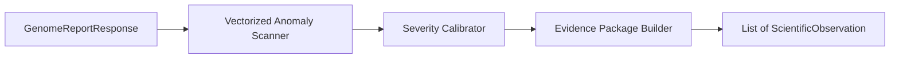

---

## SECTION 5: Problem Ranking Engine

### 5.1 Responsibilities
Evaluates the list of `ScientificObservation` objects and computes a deterministic utility score for each problem to decide which flaw must be targeted first.

### 5.2 Inputs
- `observations: List[ScientificObservation]`
- `metadata: DatasetMetadata`

### 5.3 Outputs
- `ranked_queue: PrioritizedProblemQueue`

### 5.4 Internal Algorithms
**Multi-Criteria Problem Utility Algorithm**:
$$U(O_i) = w_1 \cdot \text{Severity}(O_i) + w_2 \cdot \text{InformationLossRisk}(O_i) + w_3 \cdot \text{ImpactPotential}(O_i) - w_4 \cdot \text{RepairComplexity}(O_i)$$
Where:
- $w_1 = 0.40, w_2 = 0.30, w_3 = 0.20, w_4 = 0.10$
- `InformationLossRisk`: Zero-variance features ($1.0$), Missing target column ($0.95$), IQR Outliers ($0.40$).
- `RepairComplexity`: Drop column ($0.10$), KNN Imputation ($0.50$), SMOTE ($0.75$).

### 5.5 State
Maintains temporary in-memory priority queue (`heapq`) for the active dataset run.

### 5.6 Failure Cases
- **Utility Score Ties**: Tie-breaking uses column index order and affected column cardinality.

### 5.7 Future Improvements
- Dynamic utility weight adjustment via reinforcement learning based on past resolution efficiency.

### 5.8 Module Diagram
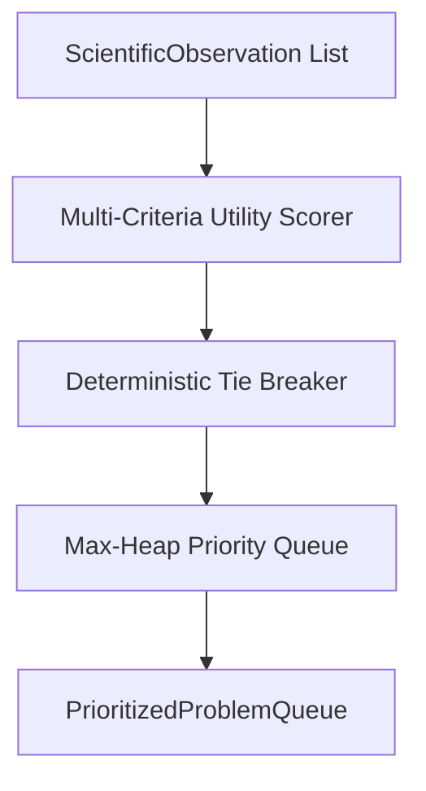

---

## SECTION 6: Reasoning Engine

### 6.1 Responsibilities
Acts as the cognitive core of the AutoScientist. Synthesizes top-ranked problems with retrieved historical scientific memories to conduct deep statistical Chain-of-Thought (CoT) reasoning regarding root causes, feature dependencies, and causal mechanisms.

### 6.2 Inputs
- `top_problem: ScientificObservation`
- `retrieved_memories: RetrievedScientificMemories`
- `report: GenomeReportResponse`

### 6.3 Outputs
- `reasoning_trace: CausalReasoningTrace`

### 6.4 Internal Algorithms
1. **Causal Graph Construction**: Maps feature relationships (e.g., if column $A$ has missing values and column $B$ has high correlation with $A$, $B$ can serve as an imputation feature).
2. **Missingness Mechanism Inference**: Evaluates whether missing data is Missing Completely at Random (MCAR), Missing at Random (MAR), or Missing Not at Random (MNAR).
3. **CoT Prompt Generation**: Prompts the internal reasoning core using a strictly structured prompt template:
   - *Observation*: Extracted statistical anomaly.
   - *Context*: Dataset dimensions, feature types, target variable.
   - *Prior Knowledge*: Successful and blacklisted recipes from Scientific Memory.
   - *Causal Task*: Infer root cause and select optimal transformation class without producing code yet.

### 6.5 State
Stateless execution per problem; appends reasoning steps to session trace log.

### 6.6 Failure Cases
- **Reasoning Loop / Timeout**: If CoT generation exceeds 5.0 seconds, falls back to a deterministic statistical decision tree rule engine.

### 6.7 Future Improvements
- Integration of formal Do-calculus Causal Inference engines (e.g., `DoWhy` DAG models).

### 6.8 Module Diagram
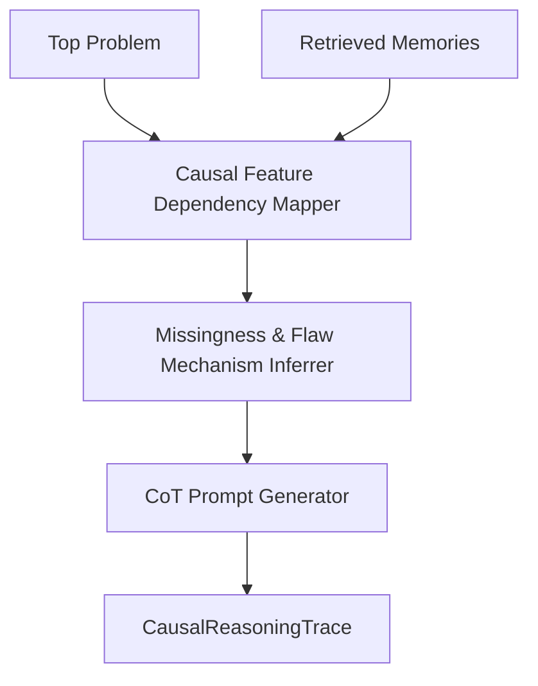

---

## SECTION 7: Scientific Memory Engine

### 7.1 Responsibilities
Provides long-term semantic memory (vector embeddings of dataset profiles and transformation recipes), short-term episodic memory (the session dataset lineage DAG), knowledge graph relationships, and Bayesian belief updates.

### 7.2 Inputs
- `query: MemoryQuery` (Dataset statistical fingerprint, observation category)
- `experiment_record: Optional[ExperimentRecord]` (to persist upon execution)

### 7.3 Outputs
- `retrieved_memories: RetrievedScientificMemories` (Proven recipes, blacklisted anti-patterns, confidence priors)

### 7.4 Internal Algorithms
1. **Statistical Fingerprint Vectorization**: Encodes 128-dimensional normalized feature vector $\mathbf{u} \in \mathbb{R}^{128}$ representing complete profiling metrics.
2. **HNSW Cosine Vector Search**: Queries PostgreSQL `pgvector` store using HNSW index ($m=16, ef=64$) for dataset profiles with cosine distance $< 0.15$.
3. **Cypher Knowledge Graph Traversal**: Executes Cypher query against Apache AGE graph database to fetch transformation nodes linked to confirmed outcomes.
4. **Bayesian Conjugate Beta-Binomial Prior Update**:
   $$\alpha_{\text{new}} = \alpha_{\text{old}} + k, \quad \beta_{\text{new}} = \beta_{\text{old}} + (1 - k) \quad (k \in \{0, 1\})$$
   $$\text{Confidence Prior } c = \frac{\alpha_{\text{new}}}{\alpha_{\text{new}} + \beta_{\text{new}}}$$

### 7.5 State
Persistent PostgreSQL + `pgvector` database and Redis query cache.

### 7.6 Failure Cases
- **Vector Database Disconnection**: Fallback to in-memory session cache and base heuristic priors.

### 7.7 Future Improvements
- Multi-agent shared memory fabric supporting simultaneous multi-scientist agent reads/writes.

### 7.8 Database Schema & Module Diagram
```sql
-- Knowledge Memory Tables
CREATE TABLE dataset_fingerprints (
    id UUID PRIMARY KEY DEFAULT uuid_generate_v4(),
    dataset_id UUID NOT NULL,
    fingerprint_vector vector(128) NOT NULL,
    health_score FLOAT NOT NULL,
    created_at TIMESTAMP WITH TIME ZONE DEFAULT CURRENT_TIMESTAMP
);

CREATE TABLE scientific_experiments (
    id UUID PRIMARY KEY DEFAULT uuid_generate_v4(),
    dataset_id UUID NOT NULL,
    flaw_category VARCHAR(100) NOT NULL,
    transformation_type VARCHAR(100) NOT NULL,
    python_script TEXT NOT NULL,
    validation_status VARCHAR(50) NOT NULL, -- CONFIRMED, FALSIFIED
    metric_delta FLOAT NOT NULL,
    health_delta FLOAT NOT NULL,
    beta_alpha INT DEFAULT 1,
    beta_beta INT DEFAULT 1
);
```

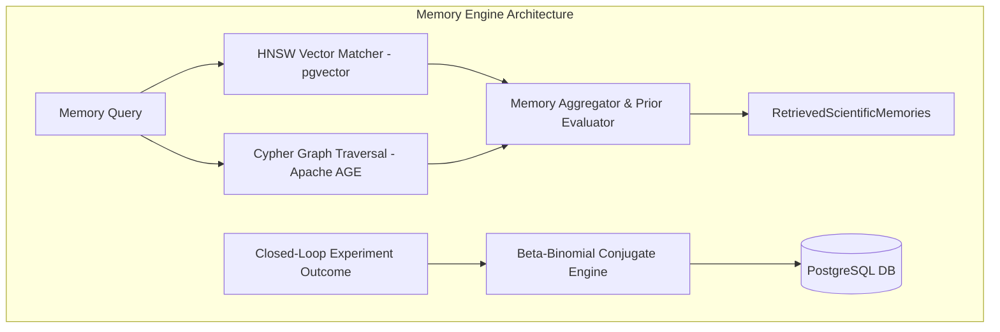

---

## SECTION 8: Hypothesis Generator

### 8.1 Responsibilities
Translates output from the Reasoning Engine into a formal, structured, testable, and falsifiable Pydantic `ScientificHypothesis`.

### 8.2 Inputs
- `reasoning_trace: CausalReasoningTrace`
- `problem: ScientificObservation`

### 8.3 Outputs
- `hypothesis: ScientificHypothesis`

### 8.4 JSON Schema Specification
```json
{
  "$schema": "http://json-schema.org/draft-07/schema#",
  "title": "ScientificHypothesis",
  "type": "object",
  "properties": {
    "id": { "type": "string" },
    "problem_id": { "type": "string" },
    "observation_summary": { "type": "string" },
    "causal_mechanism": { "type": "string" },
    "transformation_type": { "type": "string" },
    "target_column": { "type": ["string", "null"] },
    "proposed_parameters": { "type": "object" },
    "target_evaluation_metric": { "type": "string", "default": "f1_score" },
    "predicted_metric_delta": { "type": "number", "minimum": 0.001 },
    "estimated_confidence": { "type": "number", "minimum": 0.0, "maximum": 1.0 },
    "risk_level": { "type": "string", "enum": ["LOW", "MEDIUM", "HIGH"] },
    "dependencies": { "type": "array", "items": { "type": "string" } }
  },
  "required": ["id", "problem_id", "statement", "transformation_type", "target_evaluation_metric", "predicted_metric_delta"]
}
```

### 8.5 Internal Algorithms
1. **Schema Enforcement Engine**: Synthesizes JSON response from reasoning output and validates against Pydantic model.
2. **Falsifiability Check**: Verifies `predicted_metric_delta > 0.0`. Hypotheses expecting $\le 0$ metric change are discarded.

### 8.6 State
Stateless.

### 8.7 Failure Cases
- **JSON Validation Error**: Retries synthesis via strict schema prompt (max 3 retries).

### 8.8 Future Improvements
- Multi-hypothesis tournament generation (creating rival hypotheses $H_A$ vs $H_B$ for parallel testing).

### 8.9 Module Diagram
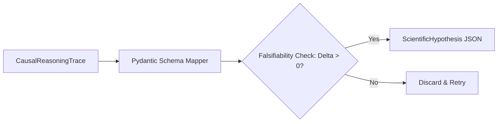

---

## SECTION 9: Experiment Planner

### 9.1 Responsibilities
Translates a `ScientificHypothesis` into a concrete, executable `ExperimentPlan` consisting of AST-validated Python code, execution order, conflict checks, and cost estimations.

### 9.2 Inputs
- `hypothesis: ScientificHypothesis`
- `metadata: DatasetMetadata`

### 9.3 Outputs
- `plan: ExperimentPlan` (Validated Python transformation script, runtime bounds)

### 9.4 Internal Algorithms
1. **Code Generation**: Synthesizes modular `pandas`/`scikit-learn` transformation code.
2. **AST Parser Validation**: Parses Python code using `ast.parse(code_str)`.
3. **AST Safety Inspector**: Traverses AST nodes to ensure no illegal imports (`os`, `sys`, `subprocess`, `socket`) or filesystem mutation calls exist.
4. **Transformation Conflict Checker**: Verifies that proposed operation does not overwrite columns required by downstream hypotheses.

### 9.5 State
Stateless.

### 9.6 Failure Cases
- **AST Security Violation / Syntax Error**: Rejects script, logs error, triggers code synthesizer retry.

### 9.7 Future Improvements
- Synthesis of Polars and DuckDB execution plans for gigabyte-scale datasets.

### 9.8 Module Diagram
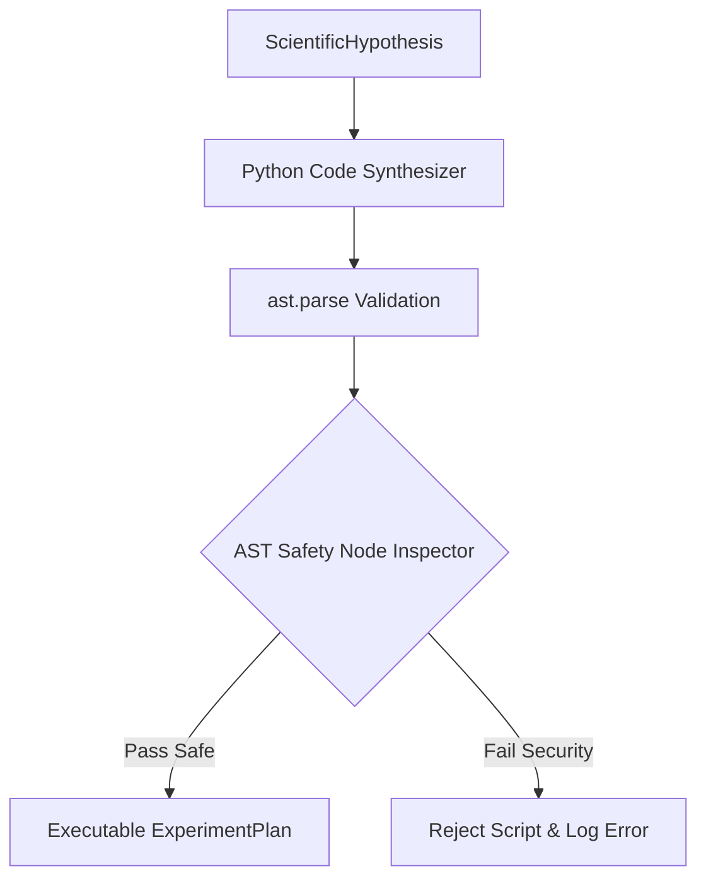

---

## SECTION 10: Confidence Engine

### 10.1 Responsibilities
Calculates a statistical confidence score $c(H_k) \in [0.0, 1.0]$ for a proposed hypothesis before allocating compute resources to sandbox execution.

### 10.2 Inputs
- `hypothesis: ScientificHypothesis`
- `memories: RetrievedScientificMemories`
- `report: GenomeReportResponse`

### 10.3 Outputs
- `confidence_assessment: ConfidenceAssessment` (Score $c$, Approval Flag)

### 10.4 Mathematical Formulation
$$c(H_k) = w_1 \cdot \text{PriorConfidence}(F, M) + w_2 \cdot (1 - \text{LeakageRisk}) + w_3 \cdot \text{MemorySimilarityScore} - w_4 \cdot \text{VarianceRisk}$$

Where:
- $w_1 = 0.35, w_2 = 0.35, w_3 = 0.20, w_4 = 0.10$
- `PriorConfidence`: Conjugate Beta distribution mean $\frac{\alpha}{\alpha + \beta}$.
- `LeakageRisk`: Target encoding without out-of-fold splits ($1.0$), Imputing target column ($1.0$), Standard scaling ($0.0$).
- Approval Rule: **APPROVED** if $c(H_k) \ge 0.60$ and $\text{LeakageRisk} < 0.30$. Otherwise **REJECTED**.

### 10.5 State
Stateless calculation.

### 10.6 Failure Cases
- **Excessive Leakage Risk**: Hard rejection ($c = 0.0$) if target column leakage is detected.

### 10.7 Future Improvements
- Conformal prediction bounds for calibrated uncertainty estimation.

### 10.8 Module Diagram
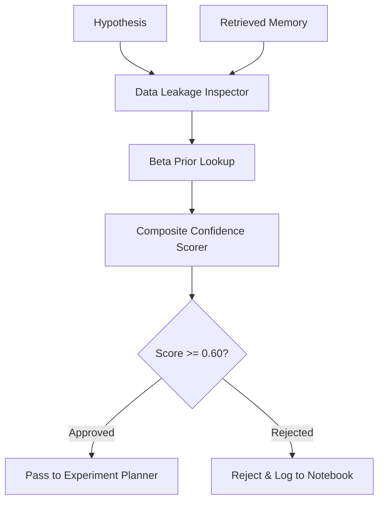

---

## SECTION 11: Execution Interface

### 11.1 Responsibilities
Acts as the architectural bridge between the AutoScientist Intelligence Layer and the physical execution infrastructure (Evolution Engine, Mutation Engine, Subprocess Sandbox).

### 11.2 Inputs
- `plan: ExperimentPlan`
- `raw_dataset_path: Path` (`/uploads/{uuid}_{filename}.csv`)

### 11.3 Outputs
- `execution_result: ExecutionResult` (Mutated CSV Path $D_k$, RAM footprint, stdout/stderr logs, execution latency)

### 11.4 Internal Architecture
1. **Subprocess Isolation**: Spawns unprivileged Python sub-process with memory limit (`RLIMIT_AS`) and CPU timeout (`SIGXCPU`).
2. **File Version Staging**: Writes output mutated dataset as `/uploads/lineage/{dataset_id}_{version_id}.csv`.
3. **Execution Verification**: Verifies output CSV file exists, is non-empty, and has valid headers.

### 11.5 State
Manages active worker process handles.

### 11.6 Failure Cases
- **Subprocess Memory Limit Exceeded (OOM)**: Returns `ExecutionResult(success=False, status='OOM_KILLED')`.

### 11.7 Future Improvements
- Containerized micro-VM (Docker / Firecracker) execution sandbox with eBPF runtime safety monitoring.

### 11.8 Module Diagram
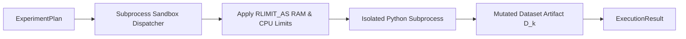

---

## SECTION 12: Evaluation Engine

### 12.1 Responsibilities
Performs closed-loop benchmark evaluation by running 5-Fold Stratified Cross-Validation on baseline dataset $D_0$ versus mutated dataset $D_k$, evaluating Pareto fitness, and deciding whether to Accept or Reject the mutation.

### 12.2 Inputs
- `execution_result: ExecutionResult`
- `raw_dataset_path: Path`
- `target_column: str`

### 12.3 Outputs
- `evaluation: EvaluationReport` (Status: `CONFIRMED` or `FALSIFIED`, Metric Deltas, Pareto Score $F(D_k)$)

### 12.4 Internal Algorithms
1. **5-Fold Stratified CV Benchmark**: Trains baseline LightGBM classifier/regressor on $D_0$ and $D_k$ using fixed random seed (`42`).
2. **Pareto Fitness Evaluation**:
   $$F(D_k) = 0.60 \cdot \text{F1}(D_k) + 0.30 \cdot \frac{H(D_k)}{100} - 0.10 \cdot \frac{\text{NumCols}(D_k)}{\text{NumCols}(D_0)}$$
3. **Acceptance Decision Rule**:
   - **ACCEPT**: If $F(D_k) > F(D_{\text{baseline}})$ AND $\Delta \text{Health Score} \ge 0$.
   - **REJECT**: If $F(D_k) \le F(D_{\text{baseline}})$ OR $\Delta \text{Health Score} < -5.0$.

### 12.5 State
Stateless evaluation runner.

### 12.6 Failure Cases
- **Undefined Target Variable**: Falls back to unsupervised reconstruction loss / silhouette cluster validation.

### 12.7 Future Improvements
- Multi-model cross-evaluation testing across Linear, Tree, and Neural architectures.

### 12.8 Module Diagram
```mermaid
graph TD
    D0[Raw D0] & Dk[Mutated Dk] --> CVRunner[5-Fold CV LightGBM Evaluator]
    CVRunner --> Profiler[Run Sprint 2 Intelligence Engine on Dk]
    Profiler --> Scorer[Pareto Fitness Scorer F(D_k)]
    Scorer --> Gate{F(D_k) > F(D_base)?}
    Gate -->|Yes| Confirm[CONFIRMED: Accept Mutation]
    Gate -->|No| Falsify[FALSIFIED: Reject & Rollback]
```

---

## SECTION 13: Research Notebook

### 13.1 Responsibilities
Acts as the lab notebook of the AutoScientist, recording a comprehensive, human-readable, and machine-exportable audit log of every scientific event, observation, hypothesis, experiment, execution outcome, and metric delta.

### 13.2 Inputs
- Event stream from all AutoScientist modules (Components 4–12).

### 13.3 Outputs
- `notebook: ResearchNotebookResponse` (Exportable Markdown, LaTeX, and JSON REST payload for Next.js frontend UI)

### 13.4 Laboratory Notebook Entry Schema
```python
class ResearchNotebookEntry(BaseModel):
    entry_id: str
    timestamp: datetime = Field(default_factory=datetime.utcnow)
    dataset_version_id: str
    observation_title: str
    causal_reasoning_summary: str
    hypothesis_statement: str
    transformation_code_diff: str
    execution_status: str
    baseline_f1_score: float
    mutated_f1_score: float
    metric_delta: float
    health_score_delta: float
    scientific_conclusion: str # CONFIRMED / FALSIFIED
    lessons_learned: str
```

### 13.5 State
Appends entries to persistent JSON notebook file under `/uploads/lineage/{dataset_id}_notebook.json`.

### 13.6 Failure Cases
- **File System Write Error**: Atomic backup logged to database table `research_notebook_entries`.

### 13.7 Future Improvements
- Interactive WebSocket streaming to the Next.js Stitch dashboard for real-time scientist logging.

### 13.8 Module Diagram


---

## SECTION 14: Learning Loop

### 14.1 Learning Feedback Loop Architecture
The **Learning Loop** completes the scientific iteration cycle. It translates empirical experimental outcomes into long-term system intelligence:

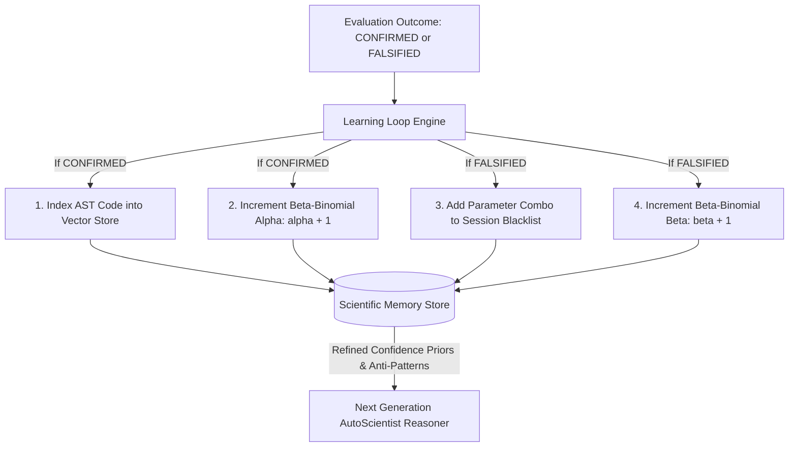

### 14.2 Mathematical Learning Dynamics
After $N$ experiment iterations, operator confidence priors converge to empirical reality:

$$\lim_{N \to \infty} E[\text{Confidence}(F, M)] = \frac{\text{Successful Mutations}(F, M)}{\text{Total Attempts}(F, M)}$$

This guarantees that over time, the AutoScientist drastically reduces search space exploration by prioritizing proven operators and avoiding blacklisted anti-patterns.

---

## SECTION 15: State Machine

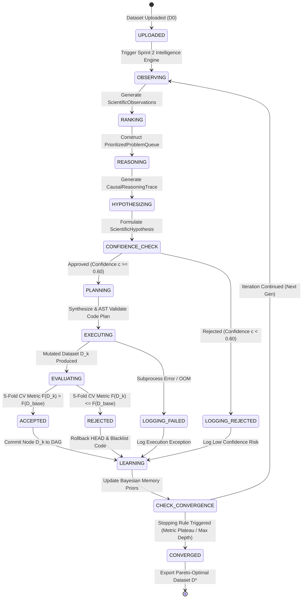

---

## SECTION 16: Sequence Diagrams

### 16.1 Dataset Analysis Sequence
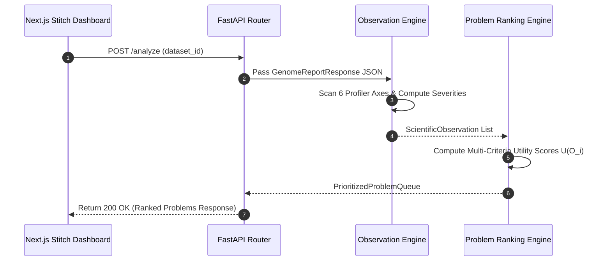

### 16.2 Experiment Planning Sequence
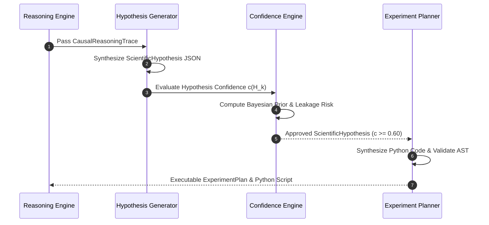

### 16.3 Memory Retrieval Sequence
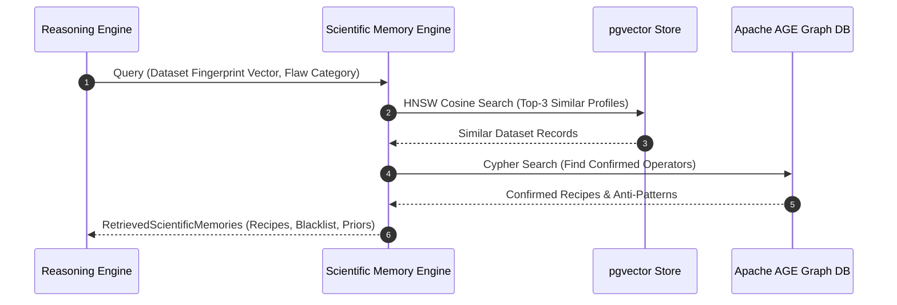

### 16.4 Evaluation Sequence
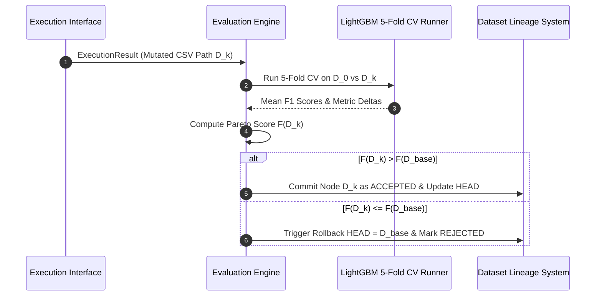

### 16.5 Research Notebook Sequence
```mermaid
sequenceDiagram
    autonumber
    participant Learn as Learning Loop
    participant Note as Research Notebook Manager
    participant Disk as File Storage
    participant UI as Next.js Stitch Dashboard

    Learn->>Note: Log Scientific Event (Observation, Hypothesis, Execution, Outcome)
    Note->>Note: Format Markdown, LaTeX Equations & Metric Diff
    Note->>Disk: Append Entry to dataset_id_notebook.json
    UI->>Note: GET /autoscientist/notebook/{dataset_id}
    Note-->>UI: Return ResearchNotebookResponse Payload
```

---

## SECTION 17: API Contracts

### Endpoint 17.1: `POST /reason`
- **Summary**: Execute Scientific Reasoning Engine on an analyzed dataset.
- **Request Payload**: `POST /reason`
```json
{
  "dataset_id": "5a7becd4-eae8-46b5-af4d-f75b46e0448f",
  "target_column": "TriageScore"
}
```
- **Response**: `200 OK`
```json
{
  "dataset_id": "5a7becd4-eae8-46b5-af4d-f75b46e0448f",
  "top_observation": {
    "id": "obs_comp_regtime",
    "category": "completeness",
    "affected_column": "RegistrationTime",
    "observed_value": 0.702,
    "severity": 0.88
  },
  "reasoning_trace": {
    "inferred_mechanism": "MISSING_AT_RANDOM",
    "causal_explanation": "RegistrationTime is missing in 70.2% of rows. Feature correlation indicates PatientRegistrationType strongly predicts missingness.",
    "recommended_transformation_class": "KNN_IMPUTE"
  }
}
```

---

### Endpoint 17.2: `POST /hypothesis`
- **Summary**: Formulate a structured, falsifiable scientific hypothesis.
- **Request Payload**: `POST /hypothesis`
```json
{
  "dataset_id": "5a7becd4-eae8-46b5-af4d-f75b46e0448f",
  "problem_id": "obs_comp_regtime"
}
```
- **Response**: `200 OK`
```json
{
  "hypothesis": {
    "id": "hyp_99a10b",
    "problem_id": "obs_comp_regtime",
    "statement": "KNN imputation (k=5) over RegistrationTime will restore missing feature interactions without introducing statistical bias.",
    "transformation_type": "KNN_IMPUTE",
    "target_column": "RegistrationTime",
    "proposed_parameters": { "n_neighbors": 5, "weights": "uniform" },
    "target_evaluation_metric": "f1_score",
    "predicted_metric_delta": 0.045,
    "estimated_confidence": 0.85,
    "risk_level": "LOW"
  }
}
```

---

### Endpoint 17.3: `POST /plan`
- **Summary**: Synthesize an AST-validated Python experiment plan.
- **Request Payload**: `POST /plan`
```json
{
  "hypothesis_id": "hyp_99a10b"
}
```
- **Response**: `200 OK`
```json
{
  "plan_id": "plan_77c10d",
  "hypothesis_id": "hyp_99a10b",
  "ast_validation_status": "PASSED_SAFE",
  "python_script": "import pandas as pd\nfrom sklearn.impute import KNNImputer\n\ndef mutate(df: pd.DataFrame) -> pd.DataFrame:\n    imputer = KNNImputer(n_neighbors=5)\n    df[['RegistrationTime']] = imputer.fit_transform(df[['RegistrationTime']])\n    return df",
  "estimated_runtime_seconds": 1.2
}
```

---

### Endpoint 17.4: `POST /evaluate`
- **Summary**: Execute closed-loop 5-fold cross-validation evaluation on a mutated dataset.
- **Request Payload**: `POST /evaluate`
```json
{
  "dataset_id": "5a7becd4-eae8-46b5-af4d-f75b46e0448f",
  "mutated_csv_path": "/uploads/lineage/5a7becd4_v1.1.0.csv",
  "target_column": "TriageScore"
}
```
- **Response**: `200 OK`
```json
{
  "evaluation_id": "eval_88d10e",
  "status": "CONFIRMED",
  "baseline_f1_score": 0.812,
  "mutated_f1_score": 0.854,
  "metric_delta": 0.042,
  "health_score_delta": 4.8,
  "pareto_fitness_score": 0.824,
  "action_taken": "COMMITTED_TO_LINEAGE_DAG"
}
```

---

### Endpoint 17.5: `GET /memory`
- **Summary**: Retrieve scientific memory recipes and anti-patterns for a given dataset anomaly.
- **Request**: `GET /memory?category=completeness&column=RegistrationTime`
- **Response**: `200 OK`
```json
{
  "retrieved_recipes_count": 2,
  "recipes": [
    {
      "transformation_type": "KNN_IMPUTE",
      "prior_confidence": 0.88,
      "success_count": 14,
      "failure_count": 2
    }
  ],
  "blacklisted_anti_patterns": ["DROP_COLUMN"]
}
```

---

### Endpoint 17.6: `GET /notebook`
- **Summary**: Fetch complete Research Notebook for UI rendering.
- **Request**: `GET /notebook?dataset_id=5a7becd4-eae8-46b5-af4d-f75b46e0448f`
- **Response**: `200 OK`
```json
{
  "dataset_id": "5a7becd4-eae8-46b5-af4d-f75b46e0448f",
  "total_entries": 3,
  "entries": [
    {
      "entry_id": "entry_01",
      "timestamp": "2026-07-28T11:40:00Z",
      "dataset_version_id": "v1.1.0-sha256:c3d4",
      "observation_title": "Severe missingness in RegistrationTime (70.2%)",
      "hypothesis_statement": "KNN Imputation (k=5) preserves interaction.",
      "execution_status": "SUCCESS",
      "baseline_f1_score": 0.812,
      "mutated_f1_score": 0.854,
      "metric_delta": 0.042,
      "scientific_conclusion": "CONFIRMED"
    }
  ]
}
```

---

### Endpoint 17.7: `GET /history`
- **Summary**: Retrieve complete iteration history and metric progression curves.
- **Request**: `GET /history?dataset_id=5a7becd4-eae8-46b5-af4d-f75b46e0448f`
- **Response**: `200 OK`
```json
{
  "dataset_id": "5a7becd4-eae8-46b5-af4d-f75b46e0448f",
  "iterations_run": 3,
  "f1_score_progression": [0.812, 0.854, 0.889],
  "health_score_progression": [82.4, 87.2, 94.6]
}
```

---

## SECTION 18: Future AI Roadmap

1. **Multi-Agent AI Scientist Teams**: Specialized autonomous agents (Profiler Agent, Causal Reasoning Agent, Code Synthesizer Agent, Validation Agent) collaborating over a shared memory blackboard.
2. **Self-Improving Meta-Prompts**: Prompt evolution engine that optimizes internal CoT prompt structures based on historical reasoning success rates.
3. **RL-Based Experiment Selection**: Reinforcement learning policy (PPO/MCTS) for choosing data mutation operators to minimize compute cost while maximizing $\Delta \text{F1}$.
4. **Distributed Reasoning & LLM Ensembles**: Parallel hypothesis generation using an ensemble of open and proprietary reasoning models (DeepMind Gemini, OpenAI o3, Anthropic Claude 3.5).
5. **Multi-Modal Dataset Support**: Extending the AutoScientist to reason over text embeddings, image metadata, audio features, and temporal time-series graphs.

---
*End of Canonical AutoScientist Specification — Dataset Genome Project*
