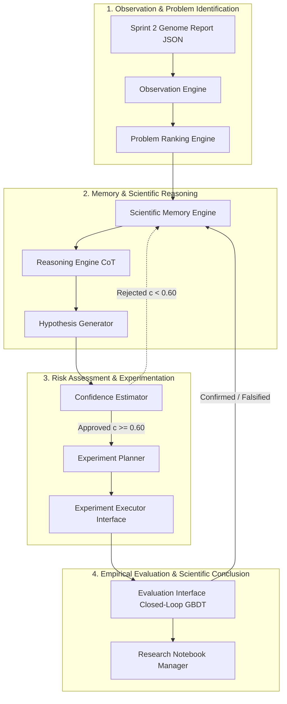

# AUTOSCIENTIST CORE
## Redesigned Autonomous Scientific Reasoning & Experimentation Architecture

---

| Metadata | Details |
| :--- | :--- |
| **System Module** | AutoScientist Core |
| **Parent Platform** | Dataset Genome |
| **Specification Version** | `3.0.0-AUTOSCIENTIST-SPEC` |
| **Architectural Paradigm** | Autonomous Scientific Agent (Non-LLM Wrapper, Closed-Loop Reasoning) |
| **Methodology Alignment** | Scientific Method (Observation → Ranking → Memory → Reasoning → Hypothesis → Confidence → Planning → Execution → Evaluation → Notebook) |
| **Sprint Alignment** | Sprint 3 Specification (Fully Compatible with Sprint 1 Uploads & Sprint 2 Intelligence Engine) |

---

## 1. Executive Summary & Scientific Philosophy

The **AutoScientist Core** is the central reasoning, decision-making, and experimentation framework of Dataset Genome. Rather than functioning as a superficial Large Language Model (LLM) wrapper that prompts a model for arbitrary cleaning code, the AutoScientist Core is an **autonomous computational scientist**. It employs formal statistical observation extraction, multi-criteria problem ranking, episodic and semantic scientific memory, deterministic hypothesis formulation, confidence estimation, AST code planning, sandboxed execution, and closed-loop empirical benchmark evaluation.

The system rigorously implements the **Scientific Method Loop**:



---

## 2. End-to-End Component Interaction Architecture

```mermaid
sequenceDiagram
    autonumber
    participant Engine as Sprint 2 Intelligence Engine
    participant Obs as Observation Engine
    participant Rank as Problem Ranking Engine
    participant Mem as Scientific Memory Engine
    participant Reason as Reasoning Engine
    participant Hypo as Hypothesis Generator
    participant Conf as Confidence Estimator
    participant Plan as Experiment Planner
    participant Exec as Experiment Executor
    participant Eval as Evaluation Interface
    participant Note as Research Notebook Manager

    Engine->>Obs: Pass GenomeReportResponse JSON
    Obs->>Rank: ScientificObservation List
    Rank->>Mem: Query Prior Experiment Patterns for Top Problems
    Mem-->>Reason: Retrieved Similar Hypotheses & Transformation Results
    Rank->>Reason: Prioritized Problem Queue
    Reason->>Hypo: Causal Reasoning Trace & Root Cause Analysis
    Hypo->>Conf: Formulated ScientificHypothesis
    Conf-->>Hypo: Confidence Score (c) & Risk Assessment
    alt Confidence c < 0.60
        Conf->>Note: Log Rejected Hypothesis (High Risk / Low Confidence)
    else Confidence c >= 0.60
        Conf->>Plan: Approved ScientificHypothesis
        Plan->>Exec: AST-Validated ExperimentPlan & Python Script
        Exec->>FileSys: Execute Transformation on Uploaded CSV
        FileSys-->>Exec: Transformed DataFrame Artifact (D_k)
        Exec->>Eval: ExecutionResult (Paths, Execution Latency, Logs)
        Eval->>Eval: Train Baseline GBDT on D_0 vs D_k (5-Fold CV)
        Eval-->>Mem: Update Memory with Confirmed/Falsified Outcome
        Eval->>Note: Record Full Experiment Lifecycle & Metric Deltas
    end
```

---

## 3. Deep Component Specifications

---

### Component 1: Observation Engine

```
+-------------------------------------------------------------------------+
|                           OBSERVATION ENGINE                            |
|                                                                         |
|  [GenomeReportResponse] ---> (Anomaly Extractor) ---> [Observations]    |
+-------------------------------------------------------------------------+
```

#### Purpose
Converts raw quantitative statistical metrics from the Sprint 2 `GenomeReportResponse` (Completeness, Consistency, Balance, Noise, Correlation, Feature Quality) into formal, canonical **Scientific Observations** enriched with empirical statistical evidence.

#### Inputs
- `report: GenomeReportResponse` (Sprint 2 Output Pydantic schema)

#### Outputs
- `observations: List[ScientificObservation]`

#### Pydantic Schema
```python
from enum import Enum
from typing import Dict, Any, Optional
from pydantic import BaseModel, Field

class ObservationCategory(str, Enum):
    COMPLETENESS = "completeness"
    CONSISTENCY = "consistency"
    BALANCE = "balance"
    NOISE = "noise"
    CORRELATION = "correlation"
    FEATURE_QUALITY = "feature_quality"

class ScientificObservation(BaseModel):
    id: str = Field(..., description="Unique slug for the observation")
    category: ObservationCategory
    metric_name: str
    affected_column: Optional[str] = None
    observed_value: float
    reference_threshold: float
    deviation_severity: float = Field(..., ge=0.0, le=1.0)
    statistical_evidence: Dict[str, Any]
```

#### Internal Workflow
1. Vectorized parsing of `report.completeness`, `report.consistency`, `report.balance`, `report.noise`, `report.correlation`, and `report.feature_quality`.
2. Cross-references metrics against statistical thresholds (e.g., column missing rate $> 10\%$, IQR outlier ratio $> 5\%$, Pearson $|r| \ge 0.85$, zero-variance $\text{Var}(X) = 0$).
3. Constructs structured `ScientificObservation` instances attaching quantitative evidence (e.g., IQR bounds, $Q1, Q3$, exact Pearson coefficient $r$).

#### Failure Cases
- **Clean Dataset (0 Flaws)**: Outputs empty list `[]`. Upstream system bypasses evolution and marks dataset optimal.
- **Malformed Input Schema**: Raises `ValueError` if `GenomeReportResponse` lacks required profiler fields.

#### Future Improvements
- Multi-dataset comparative observation extraction and cross-column interaction profiling.

---

### Component 2: Problem Ranking Engine

```
+-------------------------------------------------------------------------+
|                         PROBLEM RANKING ENGINE                          |
|                                                                         |
|  [Observations] ---> (Multi-Criteria Utility Evaluator) ---> [Queue]    |
+-------------------------------------------------------------------------+
```

#### Purpose
Prioritizes extracted scientific observations based on statistical severity, information loss risk, and downstream model impact potential using a multi-criteria utility function.

#### Inputs
- `observations: List[ScientificObservation]`
- `metadata: DatasetMetadata` (row count, column count)

#### Outputs
- `prioritized_queue: PrioritizedProblemQueue` (ranked list of observations with utility scores $U(O_i)$)

#### Mathematical Utility Formulation
$$U(O_i) = w_1 \cdot \text{DeviationSeverity}(O_i) + w_2 \cdot \text{InformationLossRisk}(O_i) - w_3 \cdot \text{ComplexityCost}(O_i)$$
Where weights $w_1 = 0.5, w_2 = 0.35, w_3 = 0.15$.

#### Internal Workflow
1. Evaluates each `ScientificObservation` through the utility function $U(O_i)$.
2. Assigns an Information Loss Risk score (e.g., zero-variance features receive $1.0$, missing target values receive $0.95$).
3. Ranks problems in descending order of utility.
4. Returns a `PrioritizedProblemQueue`.

#### Failure Cases
- **Equal Utility Scores (Tie)**: Applies deterministic secondary sorting by affected column cardinality and column index.

#### Future Improvements
- Reinforcement-learned utility weights adapted from historical mutation success rates across datasets.

---

### Component 3: Scientific Memory Engine

```
+-------------------------------------------------------------------------+
|                        SCIENTIFIC MEMORY ENGINE                         |
|                                                                         |
|  [Episodic Memory (DAG)] <---> [Semantic Vector Memory (FAISS/Chroma)]  |
+-------------------------------------------------------------------------+
```

#### Purpose
Maintains short-term episodic memory (the current dataset's mutation lineage DAG) and long-term semantic memory (historical dataset profiles, past hypotheses, executed code transformations, and validation results) to prevent repeating failed experiments and leverage proven transformation patterns.

#### Inputs
- `query: MemoryQuery` (statistical anomaly pattern, feature data types)
- `experiment_outcome: Optional[ExperimentRecord]` (to persist after evaluation)

#### Outputs
- `retrieved_memories: RetrievedScientificMemories` (similar past hypotheses, successful mutation scripts, blacklisted failed transformations)

#### Internal Workflow
1. **Episodic Memory**: Tracks current session's iteration tree ($D_0 \to D_1 \to D_2$).
2. **Semantic Memory**: Computes vector embedding of current dataset statistical profile (using normalized metrics vector).
3. Performs $k$-Nearest Neighbors ($k\text{-NN}$) lookup against historical experiment memory bank.
4. Returns top-$k$ successful transformation recipes and explicit blacklist of transformations that failed on similar statistical patterns.

#### Failure Cases
- **Cold Start**: Empty memory bank returns empty recipe list; system defaults to base statistical heuristics.

#### Future Improvements
- Distributed vector store (pgvector / Qdrant) with graph-based dataset similarity indexing.

---

### Component 4: Reasoning Engine

```
+-------------------------------------------------------------------------+
|                            REASONING ENGINE                             |
|                                                                         |
|  [Top Problem + Memory] ---> (Chain-of-Thought Causal Graph) ---> [Trace]|
+-------------------------------------------------------------------------+
```

#### Purpose
Synthesizes top-ranked scientific observations with retrieved memories to perform deep statistical Chain-of-Thought (CoT) reasoning regarding the root causes of data flaws and potential interaction effects.

#### Inputs
- `problem: ScientificObservation`
- `memories: RetrievedScientificMemories`
- `report: GenomeReportResponse`

#### Outputs
- `reasoning_trace: CausalReasoningTrace`

#### Internal Workflow
1. Constructs a structured CoT prompt detailing the observed statistical anomaly, dataset shape, data types, and historical memory context.
2. Prompts the reasoning core to analyze root causes (e.g., "Is `RegistrationTime` missing at random (MAR) or missing not at random (MNAR)?").
3. Maps feature dependencies to ensure transforming column $A$ does not inadvertently corrupt correlated column $B$.
4. Generates a structured `CausalReasoningTrace` containing the formal scientific rationale.

#### Failure Cases
- **LLM Reasoning Timeout**: Retries with a deterministic fallback heuristic ruleset based on classical statistics.

#### Future Improvements
- Integration of Symbolic Causal Inference engines (Do-calculus graph models).

---

### Component 5: Hypothesis Generator

```
+-------------------------------------------------------------------------+
|                           HYPOTHESIS GENERATOR                          |
|                                                                         |
|  [Reasoning Trace] ---> (Falsifiable Schema Engine) ---> [Hypothesis]   |
+-------------------------------------------------------------------------+
```

#### Purpose
Formulates precise, testable, and falsifiable scientific hypotheses $H_k = \langle \text{Statement}, \text{TransformationType}, \text{ExpectedMechanism}, \text{TargetMetric}, \text{PredictedDelta} \rangle$ aimed at resolving prioritized dataset flaws.

#### Inputs
- `reasoning_trace: CausalReasoningTrace`
- `problem: ScientificObservation`

#### Outputs
- `hypothesis: ScientificHypothesis`

#### Pydantic Schema
```python
class ScientificHypothesis(BaseModel):
    id: str
    problem_id: str
    statement: str = Field(..., description="Falsifiable hypothesis statement")
    transformation_type: str = Field(..., description="Target operation, e.g. KNN_IMPUTE, WINSORIZE, PRUNE_COLLINEAR")
    target_column: Optional[str]
    proposed_parameters: Dict[str, Any]
    expected_mechanism: str
    target_evaluation_metric: str = Field("f1_score", description="Downstream validation metric to optimize")
    predicted_metric_delta: float = Field(..., description="Expected percentage improvement in target metric")
```

#### Internal Workflow
1. Takes causal reasoning output and translates it into a structured Pydantic `ScientificHypothesis`.
2. Validates that the hypothesis is falsifiable (defines explicit measurable metric target $\Delta \text{Metric} > 0$).
3. Assigns candidate hyperparameters (e.g., $n\_neighbors = 5$ for KNN imputation).

#### Failure Cases
- **Unfalsifiable Statement**: Rejects hypothesis if `predicted_metric_delta <= 0`.

#### Future Improvements
- Multi-hypothesis competition where rival hypotheses ($H_A$ vs $H_B$) are generated simultaneously for tournament evaluation.

---

### Component 6: Confidence Estimator

```
+-------------------------------------------------------------------------+
|                           CONFIDENCE ESTIMATOR                          |
|                                                                         |
|  [Hypothesis + Memory] ---> (Bayesian Risk Assessment) ---> [Confidence] |
+-------------------------------------------------------------------------+
```

#### Purpose
Evaluates the statistical probability of success $P(\text{Success} \mid H_k)$ and data integrity risk of a proposed hypothesis before allocating compute resources to code planning and experiment execution.

#### Inputs
- `hypothesis: ScientificHypothesis`
- `memories: RetrievedScientificMemories`
- `report: GenomeReportResponse`

#### Outputs
- `confidence_assessment: ConfidenceAssessment` (Score $c \in [0.0, 1.0]$, Approval Status)

#### Mathematical Formulation
$$c(H_k) = \alpha \cdot S_{\text{memory\_similarity}} + \beta \cdot (1 - \text{Risk}_{\text{leakage}}) + \gamma \cdot \text{MetricBaselineScore}$$
Where $\alpha = 0.4, \beta = 0.4, \gamma = 0.2$.

#### Internal Workflow
1. Checks memory store for previous occurrences of similar transformations on matching dataset distributions.
2. Calculates data leakage risk (e.g., target encoding without out-of-fold splits receives high leakage risk).
3. If composite score $c(H_k) \ge 0.60$, hypothesis is **APPROVED**. If $c(H_k) < 0.60$, hypothesis is **REJECTED** and logged.

#### Failure Cases
- **High Risk Disapproval**: Rejects hypothesis if target leakage risk $> 0.30$ regardless of memory score.

#### Future Improvements
- Conformal prediction bounds for uncertainty estimation.

---

### Component 7: Experiment Planner

```
+-------------------------------------------------------------------------+
|                            EXPERIMENT PLANNER                           |
|                                                                         |
|  [Approved Hypothesis] ---> (AST Code Synthesizer) ---> [ExperimentPlan]|
+-------------------------------------------------------------------------+
```

#### Purpose
Translates an approved `ScientificHypothesis` into a concrete, deterministic `ExperimentPlan` consisting of AST-validated Python code mutations (`pandas`/`scikit-learn`), dataset staging paths, and evaluation benchmarks.

#### Inputs
- `hypothesis: ScientificHypothesis`
- `metadata: DatasetMetadata`

#### Outputs
- `plan: ExperimentPlan` (Validated Python transformation script, execution configuration)

#### Internal Workflow
1. Generates modular Python pandas/scikit-learn transformation code matching `hypothesis.transformation_type`.
2. Parses code via Python `ast.parse()` to guarantee syntactic validity.
3. Inspects AST nodes to verify safety (ensures no `os.system`, `subprocess`, or file deletion calls exist).
4. Packages transformation script into `ExperimentPlan`.

#### Failure Cases
- **AST Validation Failure**: Triggers code generator self-correction loop (max 3 retries).

#### Future Improvements
- Polyglot execution planning (supporting Polars and DuckDB execution plans for extreme scale).

---

### Component 8: Experiment Executor Interface

```
+-------------------------------------------------------------------------+
|                   EXPERIMENT EXECUTOR INTERFACE                         |
|                                                                         |
|  [ExperimentPlan] ---> (Subprocess Sandbox) ---> [ExecutionResult]      |
+-------------------------------------------------------------------------+
```

#### Purpose
Executes the `ExperimentPlan` in an isolated Python runtime environment to apply dataset transformations safely and produce the mutated dataset artifact ($D_k$).

#### Inputs
- `plan: ExperimentPlan`
- `raw_dataset_path: Path` (`/uploads/UUID_filename.csv`)

#### Outputs
- `result: ExecutionResult` (Mutated CSV Path, execution latency, RAM usage, stdout/stderr logs)

#### Internal Workflow
1. Spawns an isolated Python subprocess with memory and CPU execution limits.
2. Reads raw dataset $D_0$, applies the AST-validated code transformation script, and validates output DataFrame integrity.
3. Saves mutated dataset artifact as `/uploads/UUID_mutated_v{k}.csv`.
4. Measures execution runtime, peak memory usage, and captures standard execution logs.

#### Failure Cases
- **Subprocess Exception / OOM**: Returns `ExecutionResult(success=False, error_message=str(e))`. Cleanup removes partial files.

#### Future Improvements
- Containerized micro-VM (Docker / Firecracker) sandboxing with eBPF runtime profiling.

---

### Component 9: Evaluation Interface

```
+-------------------------------------------------------------------------+
|                           EVALUATION INTERFACE                          |
|                                                                         |
|  [Mutated D_k vs Raw D_0] ---> (Closed-Loop GBDT) ---> [EvaluationReport]|
+-------------------------------------------------------------------------+
```

#### Purpose
Performs closed-loop benchmark evaluation by training baseline GBDT models (LightGBM / XGBoost / Random Forest) on raw dataset ($D_0$) versus mutated dataset ($D_k$), measuring statistical performance deltas ($\Delta \text{F1}, \Delta \text{RMSE}, \Delta \text{HealthScore}$).

#### Inputs
- `execution_result: ExecutionResult`
- `raw_dataset_path: Path`
- `target_column: Optional[str]`

#### Outputs
- `evaluation: EvaluationReport` (Hypothesis Status: `CONFIRMED` or `FALSIFIED`, Metric Deltas, Pareto Score)

#### Internal Workflow
1. Loads raw dataset $D_0$ and mutated dataset $D_k$.
2. Runs 5-Fold Stratified Cross-Validation using a baseline LightGBM classifier/regressor on $D_0$.
3. Runs identical 5-Fold Cross-Validation pipeline on $D_k$.
4. Computes performance metric delta:
   $$\Delta \text{Metric} = \text{Metric}(D_k) - \text{Metric}(D_0)$$
5. Reruns Sprint 2 `DatasetIntelligenceEngine` on $D_k$ to compute $\Delta \text{HealthScore}$.
6. If $\Delta \text{Metric} > 0$ and $\Delta \text{HealthScore} \ge 0$, hypothesis is marked **CONFIRMED**. Otherwise marked **FALSIFIED**.

#### Failure Cases
- **Target Variable Undefined**: Performs unsupervised reconstruction loss / cluster silhouette score evaluation.

#### Future Improvements
- Multi-model evaluation suite testing across Linear models, GBDTs, and Deep Neural Networks (TabNet).

---

### Component 10: Research Notebook Manager

```
+-------------------------------------------------------------------------+
|                       RESEARCH NOTEBOOK MANAGER                         |
|                                                                         |
|  [Event Stream] ---> (LaTeX / Markdown Formatter) ---> [ResearchNotebook]|
+-------------------------------------------------------------------------+
```

#### Purpose
Logs and formats the entire scientific lifecycle (Observations, Reasoning Traces, Hypotheses, Confidence Assessments, Code Mutation Plans, Execution Logs, and Evaluation Reports) into a human-readable and machine-exportable **AI Scientist Research Notebook**.

#### Inputs
- Event stream from Components 1 through 9.

#### Outputs
- `notebook: ResearchNotebookResponse` (Exportable Markdown, LaTeX, and JSON REST payload for Next.js frontend UI)

#### Internal Workflow
1. Listens to execution events emitted by each AutoScientist component.
2. Formats entries with timestamped scientific entries, mathematical equations, code diffs, and validation metric charts.
3. Exposes REST API endpoints (`GET /autoscientist/notebook/{dataset_id}`) for live UI rendering on Next.js frontend.

#### Failure Cases
- **Persistence Error**: Writes notebook state to disk `/uploads/UUID_notebook.json` as an atomic fallback.

#### Future Improvements
- Live WebSocket streaming notebook editor supporting human-in-the-loop interactive scientist annotations.

---

## 4. Scientific Method Workflow Mapping Matrix

| Scientific Step | AutoScientist Core Component | Output Artifact |
| :--- | :--- | :--- |
| **1. Observation** | **Component 1: Observation Engine** & **Component 2: Problem Ranking Engine** | `PrioritizedProblemQueue` |
| **2. Prior Research Lookup** | **Component 3: Scientific Memory Engine** | `RetrievedScientificMemories` |
| **3. Causal Reasoning** | **Component 4: Reasoning Engine** | `CausalReasoningTrace` |
| **4. Hypothesis Formulation** | **Component 5: Hypothesis Generator** | `ScientificHypothesis` |
| **5. Risk & Confidence Assessment** | **Component 6: Confidence Estimator** | `ConfidenceAssessment` |
| **6. Experiment Planning** | **Component 7: Experiment Planner** | `ExperimentPlan` (AST Code) |
| **7. Execution & Sandboxing** | **Component 8: Experiment Executor Interface** | `ExecutionResult` ($D_k$) |
| **8. Empirical Validation** | **Component 9: Evaluation Interface** | `EvaluationReport` (Confirmed/Falsified) |
| **9. Scientific Documentation** | **Component 10: Research Notebook Manager** | `ResearchNotebookResponse` |

---

## 5. Compatibility & Integration with Existing Monorepo

The redesigned **AutoScientist Core** is 100% backward compatible with existing Sprint 1 and Sprint 2 code:

1. **Sprint 1 File Storage**: Reads uploaded datasets directly from `backend/uploads/{uuid}_{filename}` as stored by `utils/file_utils.py`.
2. **Sprint 2 Intelligence Engine**: Ingests `GenomeReportResponse` generated by `services/dataset_intelligence/engine.py` without modifying profiler implementations.
3. **FastAPI Route Architecture**: Extends `backend/api/router.py` with `autoscientist` sub-routes:
   - `POST /autoscientist/hypothesize`
   - `POST /autoscientist/experiment`
   - `GET /autoscientist/notebook/{dataset_id}`
4. **Next.js 15 Frontend**: Connects directly to the existing "Continue to AI Scientist" button on the Google Stitch UI dashboard (`stitch-dashboard.tsx`).

---
*End of AutoScientist Core Architecture Specification*
