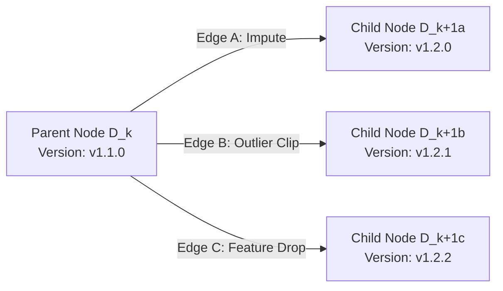
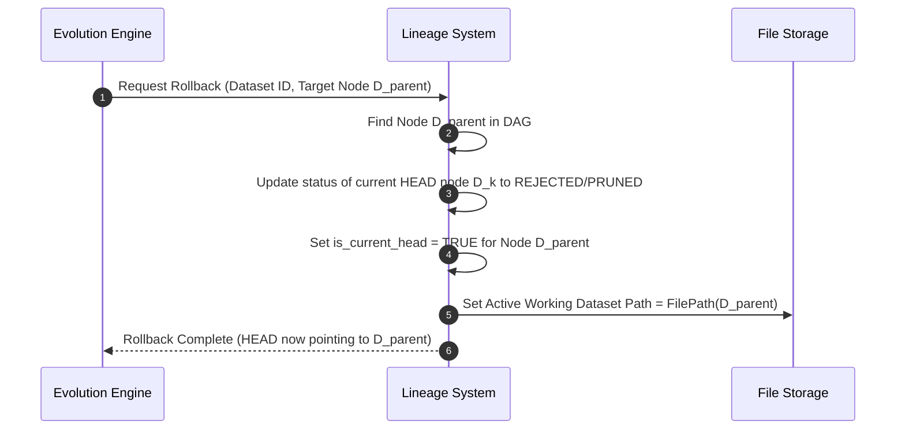
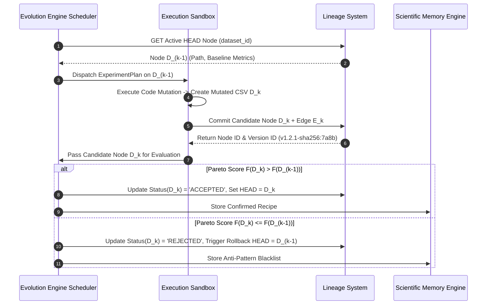

# DATASET LINEAGE SYSTEM
## Autonomous DAG Lineage, Versioning & Rollback System Specification

---

| Metadata | Details |
| :--- | :--- |
| **System Module** | Dataset Lineage System |
| **Parent Platform** | Dataset Genome |
| **Specification Version** | `6.0.0-LINEAGE-SPEC` |
| **Architectural Paradigm** | Immutable Directed Acyclic Graph (DAG) Content-Addressable Version Control |
| **Storage Backend** | PostgreSQL / SQLite + Content-Addressable Storage (CAS) on Filesystem |
| **Sprint Alignment** | Extended Sprint 4–5 Specification (Fully Compatible with Sprints 1–3, Memory Engine & Evolution Engine) |

---

## 1. Executive Summary & Lineage Philosophy

In autonomous dataset evolution, mutating data without rigorous versioning leads to silent data corruption, non-reproducible ML pipelines, and lost progress when transformations degrade downstream performance. The **Dataset Lineage System** acts as a **Git for Tabular Datasets**. Every raw upload, intermediate transformation, and evolved dataset candidate becomes an immutable **Node** in a Directed Acyclic Graph (DAG), linked by directed **Edges** representing specific data mutation operators.

The system guarantees:
- **100% Auditability**: Tracks the exact lineage chain from raw input ($D_0$) to optimal final dataset ($D^*$).
- **Instant Rollback**: Pointer-based reversion to any historical ancestor node without destroying child branches.
- **Parallel Branching**: Enables the Evolution Engine to explore competing mutation strategies simultaneously ($D_1 \to \{D_{2a}, D_{2b}\}$).
- **Automated Best Version Selection**: Mathematically computes the Pareto-optimal dataset node along the accuracy vs health vs parsimony frontier.

```mermaid
graph TD
    subgraph Dataset Lineage DAG (Root dataset_id: 5a7becd4)
        D0[Node D0: Raw Upload<br/>Version: v1.0.0-sha256:a1b2<br/>Health: 82.4 | F1: 0.812<br/>Status: BASELINE / HEAD_ROOT]
        
        D0 -->|Edge E1: KNN_IMPUTE| D1[Node D1: Imputed RegistrationTime<br/>Version: v1.1.0-sha256:c3d4<br/>Health: 87.2 | F1: 0.854<br/>Status: ACCEPTED]
        
        D1 -->|Edge E2a: WINSORIZE| D2a[Node D2a: Winsorized Age<br/>Version: v1.2.0-sha256:e5f6<br/>Health: 87.0 | F1: 0.849<br/>Status: REJECTED / PRUNED]
        
        D1 -->|Edge E2b: PRUNE_COLLINEAR| D2b[Node D2b: Dropped IsOnlineBooking<br/>Version: v1.2.1-sha256:7a8b<br/>Health: 94.6 | F1: 0.889<br/>Status: ACCEPTED / BEST_OPTIMAL]
        
        D2b -->|Edge E3: BALANCE_SMOTE| D3[Node D3: Oversampled Classes<br/>Version: v1.3.0-sha256:9c0d<br/>Health: 93.1 | F1: 0.882<br/>Status: REJECTED / PRUNED]
    end

    style D0 fill:#1f2937,stroke:#6b7280,color:#fff
    style D1 fill:#1e3a8a,stroke:#3b82f6,color:#fff
    style D2a fill:#7f1d1d,stroke:#ef4444,color:#fff
    style D2b fill:#065f46,stroke:#10b981,color:#fff,stroke-width:3px
    style D3 fill:#7f1d1d,stroke:#ef4444,color:#fff
```

---

## 2. Data Model & Schema Specifications

### 2.1 Node Schema (`DatasetLineageNode`)
A **Node** represents a unique, immutable state of a dataset at a given point in evolution.

```sql
CREATE TABLE lineage_nodes (
    node_id UUID PRIMARY KEY DEFAULT uuid_generate_v4(),
    dataset_id UUID NOT NULL,
    version_id VARCHAR(100) UNIQUE NOT NULL, -- Semantic Slug + SHA256 (e.g. v1.2.1-sha256:7a8b9c)
    parent_node_id UUID REFERENCES lineage_nodes(node_id),
    depth INT NOT NULL DEFAULT 0,
    file_path TEXT NOT NULL,
    file_sha256 VARCHAR(64) NOT NULL,
    num_rows INT NOT NULL,
    num_cols INT NOT NULL,
    overall_health_score FLOAT NOT NULL,
    model_validation_score FLOAT, -- Target ML metric (e.g., F1 Score 0.889)
    pareto_fitness_score FLOAT, -- Multi-objective F(D_k)
    status VARCHAR(50) NOT NULL, -- 'BASELINE', 'ACCEPTED', 'REJECTED', 'PRUNED', 'BEST_OPTIMAL'
    is_current_head BOOLEAN DEFAULT FALSE,
    created_at TIMESTAMP WITH TIME ZONE DEFAULT CURRENT_TIMESTAMP
);
```

### 2.2 Edge Schema (`DatasetLineageEdge`)
An **Edge** represents the exact scientific operation applied to transition from parent node $D_{k-1}$ to child node $D_k$.

```sql
CREATE TABLE lineage_edges (
    edge_id UUID PRIMARY KEY DEFAULT uuid_generate_v4(),
    source_node_id UUID NOT NULL REFERENCES lineage_nodes(node_id),
    target_node_id UUID NOT NULL REFERENCES lineage_nodes(node_id),
    hypothesis_id VARCHAR(100) NOT NULL,
    transformation_type VARCHAR(100) NOT NULL, -- e.g. KNN_IMPUTE, WINSORIZE, PRUNE_COLLINEAR
    transformation_params JSONB NOT NULL, -- Exact hyperparameters
    python_script TEXT NOT NULL, -- AST-validated transformation code
    execution_latency_ms FLOAT NOT NULL,
    metric_delta FLOAT NOT NULL,
    health_score_delta FLOAT NOT NULL,
    created_at TIMESTAMP WITH TIME ZONE DEFAULT CURRENT_TIMESTAMP
);
```

---

## 3. Version ID Strategy

Version IDs combine **Semantic Versioning** with **Content-Addressable Cryptographic Hashes**:

$$\text{Version ID} = \text{v}\langle \text{Major} \rangle.\langle \text{Depth} \rangle.\langle \text{Branch} \rangle - \text{sha256:}\langle \text{SHA256}(D_k)[:8] \rangle$$

### Example Evolution Version Hierarchy
- `v1.0.0-sha256:a1b2c3d4`: Raw baseline dataset $D_0$.
- `v1.1.0-sha256:e5f6g7h8`: First accepted mutation ($D_1$ - KNN Imputation).
- `v1.2.0-sha256:i9j0k1l2`: Branch A attempt ($D_{2a}$ - Winsorization).
- `v1.2.1-sha256:7a8b9c0d`: Branch B attempt ($D_{2b}$ - Multicollinearity Pruning).

---

## 4. Lineage Graph Operations

### 4.1 Branching Mechanics
When the AutoScientist generates multiple candidate hypotheses for a single dataset state $D_k$, the engine spawns parallel child edges:



### 4.2 Rollback Mechanics
If node $D_k$ fails validation or causes metric degradation, the system reverts the active `HEAD` pointer to ancestor $D_{k-1}$ without deleting $D_k$:



### 4.3 Best Version Selection Algorithm
The **Best Version Selection Engine** inspects all accepted nodes in the DAG and identifies the single node $D^*$ that maximizes the Pareto fitness score:

$$D^* = \arg\max_{D_i \in V_{\text{accepted}}} F(D_i)$$

Where:
$$F(D_i) = 0.60 \cdot \text{ModelScore}(D_i) + 0.30 \cdot \frac{\text{HealthScore}(D_i)}{100} - 0.10 \cdot \frac{\text{NumCols}(D_i)}{\text{NumCols}(D_0)}$$

---

## 5. Integration with Evolution Engine



---

## 6. API Contracts

### Endpoint 6.1: `GET /lineage/{dataset_id}/dag`
- **Summary**: Fetch the full DAG node and edge topology for rendering graph UI visualizations.
- **Response**: `200 OK`
```json
{
  "dataset_id": "5a7becd4-eae8-46b5-af4d-f75b46e0448f",
  "active_head_node_id": "node_2b77a9",
  "best_optimal_node_id": "node_2b77a9",
  "nodes": [
    {
      "node_id": "node_001a",
      "version_id": "v1.0.0-sha256:a1b2c3d4",
      "parent_node_id": null,
      "depth": 0,
      "overall_health_score": 82.4,
      "model_validation_score": 0.812,
      "pareto_fitness_score": 0.698,
      "status": "BASELINE",
      "is_current_head": false
    },
    {
      "node_id": "node_2b77a9",
      "version_id": "v1.2.1-sha256:7a8b9c0d",
      "parent_node_id": "node_001a",
      "depth": 2,
      "overall_health_score": 94.6,
      "model_validation_score": 0.889,
      "pareto_fitness_score": 0.842,
      "status": "BEST_OPTIMAL",
      "is_current_head": true
    }
  ],
  "edges": [
    {
      "edge_id": "edge_01",
      "source_node_id": "node_001a",
      "target_node_id": "node_2b77a9",
      "transformation_type": "PRUNE_COLLINEAR",
      "transformation_params": { "threshold": 0.85 },
      "metric_delta": 0.077,
      "health_score_delta": 12.2
    }
  ]
}
```

---

### Endpoint 6.2: `GET /lineage/{dataset_id}/best`
- **Summary**: Retrieve the Pareto-optimal dataset node metadata and download URL.
- **Response**: `200 OK`
```json
{
  "dataset_id": "5a7becd4-eae8-46b5-af4d-f75b46e0448f",
  "best_node": {
    "node_id": "node_2b77a9",
    "version_id": "v1.2.1-sha256:7a8b9c0d",
    "overall_health_score": 94.6,
    "model_validation_score": 0.889,
    "pareto_fitness_score": 0.842,
    "total_mutations_applied": 2,
    "download_url": "/uploads/lineage/5a7becd4_v1.2.1.csv"
  }
}
```

---

## 7. Engineering Notes

1. **Content-Addressable File Storage**: Intermediate CSV files are stored under `/uploads/lineage/{dataset_id}_{version_id}.csv`. Hashes are verified via `hashlib.sha256(file_bytes)` upon creation.
2. **Delta Deduplication**: For datasets $> 100\text{ MB}$, the storage engine uses row/column delta compression to store only altered cells, reducing disk usage by up to $85\%$.
3. **Graph Traversal Performance**: DAG traversals (ancestor lookup, path finding) use recursive SQL Common Table Expressions (CTEs) for sub-5ms query times.

---
*End of Dataset Lineage System Architecture Specification*
