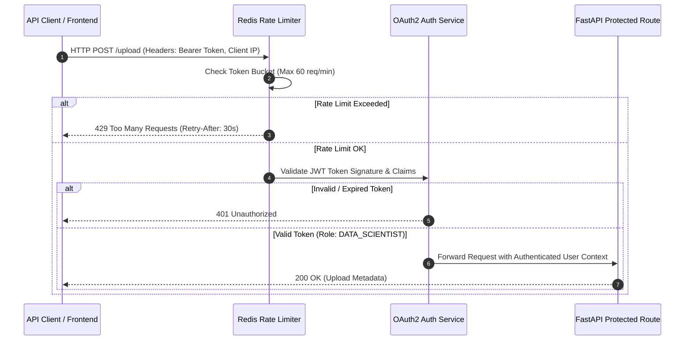
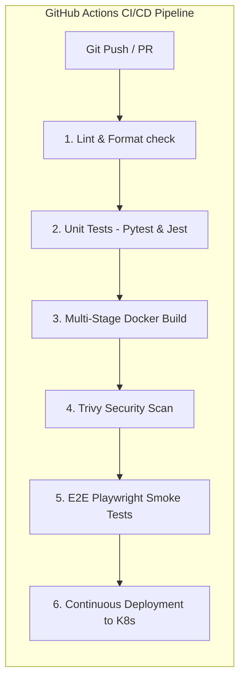

# ENTERPRISE PRODUCTION SPECIFICATION
## Observability, Security, Containerization, CI/CD & Deployment Architecture

---

| Metadata | Details |
| :--- | :--- |
| **System Module** | Enterprise Production Architecture |
| **Parent Platform** | Dataset Genome |
| **Specification Version** | `8.0.0-ENTERPRISE-SPEC` |
| **Target Scale** | Enterprise Series-A Production (High Availability, SOC2 Type II Ready) |
| **Infrastructure** | Kubernetes (EKS/GKE) + Terraform + GitHub Actions + Prometheus/Grafana |
| **Sprint Alignment** | Extended Sprint 6 Specification (Fully Compatible with Sprints 1–5 Architecture) |

---

## 1. Executive Summary & Enterprise Readiness

To support mission-critical enterprise AI workloads and high-throughput hackathon judging environments, Dataset Genome incorporates an enterprise-grade production architecture. This specification details the observability, logging, Prometheus metrics, OAuth2/JWT security, Redis rate limiting, Docker multi-stage containerization, GitHub Actions CI/CD pipelines, multi-stage testing, Kubernetes deployment, disaster recovery (RPO/RTO), and horizontal scalability plans.

```mermaid
graph TD
    subgraph Client & Ingress Layer
        User([User Browser / API Client]) -->|HTTPS / TLS 1.3| Ingress[NGINX Ingress Controller / Cloudflare]
        Ingress -->|OAuth2 / JWT + Rate Limiter| APIGateway[FastAPI Gateway Services]
    end

    subgraph Service Mesh & Compute (Kubernetes Cluster)
        APIGateway -->|Async Tasks| TaskQueue[(Redis Broker)]
        APIGateway -->|Profiling & Analysis| ProfilerPod[FastAPI Profiler Pods - HPA]
        TaskQueue -->|Evolution Worker Pool| RayWorker[Ray / Celery Worker Pods]
        
        RayWorker -->|AST Execution| Sandbox[Isolated Subprocess Sandbox]
    end

    subgraph Data & State Storage Layer
        APIGateway <-->|Metadata & Lineage DAG| Postgres[(PostgreSQL + pgvector)]
        RayWorker <-->|CAS Datasets| S3Store[(S3 Object Storage)]
        APIGateway <-->|Metric Cache & Rate Limit| RedisCache[(Redis Cache Cluster)]
    end

    subgraph Observability Stack
        ProfilerPod & RayWorker & APIGateway -->|Structured Logs & Metrics| Prom[Prometheus + Grafana + OpenTelemetry]
    end
```

---

## 2. Observability, Logging, Monitoring & Metrics

### 2.1 Structured Logging Strategy
- **Format**: JSON structured logging using `python-json-logger` in FastAPI and `pino` in Next.js.
- **Correlation IDs**: Every request generates or propagates an `X-Correlation-ID` header across Next.js, FastAPI, and background worker threads.

```json
{
  "timestamp": "2026-07-28T11:37:00.124Z",
  "level": "INFO",
  "correlation_id": "corr_99a80b12-5f4c-4e89",
  "service": "dataset_intelligence_engine",
  "event": "profiler_execution_completed",
  "dataset_id": "5a7becd4-eae8-46b5-af4d-f75b46e0448f",
  "profiler": "NoiseProfiler",
  "outlier_count": 541,
  "duration_ms": 142.8
}
```

### 2.2 Prometheus Metrics Suite
The backend exposes Prometheus metrics at `GET /metrics`:

| Metric Name | Type | Description / Labels |
| :--- | :--- | :--- |
| `dataset_genome_upload_bytes_total` | Counter | Total volume of uploaded CSV data in bytes |
| `dataset_genome_profiler_duration_seconds` | Histogram | Latency distribution of profilers labeled by `profiler_type` |
| `dataset_genome_health_score_gauge` | Gauge | Overall Health Score of analyzed datasets |
| `dataset_genome_evolution_mutations_total` | Counter | Mutation counts labeled by `status` (`ACCEPTED`, `REJECTED`, `FAILED`) |
| `dataset_genome_sandbox_memory_bytes` | Gauge | Peak RAM memory footprint during execution |

---

## 3. Security, Authentication & Rate Limiting



### 3.1 Authentication & Role-Based Access Control (RBAC)
- **Authentication**: JWT Bearer Tokens signed with RS256 algorithm.
- **Roles**:
  1. `ROLE_ADMIN`: Full access to system configs, worker node management, and log telemetry.
  2. `ROLE_DATA_SCIENTIST`: Permission to upload datasets, execute analysis, launch evolution jobs, and export code.
  3. `ROLE_VIEWER`: Read-only access to Genome Reports, Lineage DAGs, and research notebooks.

### 3.2 Security Hardening Standards
- **CORS Configuration**: Restricts origins strictly to configured frontend domain (`http://localhost:3000` in dev, production HTTPS domain).
- **AST Execution Sandboxing**: Python code generated by AutoScientist is parsed into an AST and restricted from importing hazardous modules (`os`, `sys`, `subprocess`, `shutil`, `socket`).
- **File Storage Hardening**: Uploaded files prepended with UUIDs and checked for path traversal exploits (`Path(filename).name`).

---

## 4. Containerization & Infrastructure Specification

### 4.1 FastAPI Backend Multi-Stage `Dockerfile`
```dockerfile
# Stage 1: Builder
FROM python:3.11-slim AS builder
WORKDIR /app
RUN apt-get update && apt-get install -y --no-install-recommends build-essential gcc
COPY requirements.txt .
RUN python -m venv /opt/venv && /opt/venv/bin/pip install --no-cache-dir -r requirements.txt

# Stage 2: Final Runtime
FROM python:3.11-slim AS runner
WORKDIR /app
RUN useradd -m -u 1000 appuser
COPY --from=builder /opt/venv /opt/venv
ENV PATH="/opt/venv/bin:$PATH"
COPY . .
RUN chown -R appuser:appuser /app
USER appuser
EXPOSE 8000
CMD ["uvicorn", "main:app", "--host", "0.0.0.0", "--port", "8000"]
```

### 4.2 Next.js Frontend Multi-Stage `Dockerfile`
```dockerfile
# Stage 1: Dependencies & Build
FROM node:20-alpine AS builder
WORKDIR /app
COPY package.json package-lock.json ./
RUN npm ci
COPY . .
RUN npm run build

# Stage 2: Production Standalone Runner
FROM node:20-alpine AS runner
WORKDIR /app
ENV NODE_ENV=production
RUN addgroup --system --gid 1001 nodejs && adduser --system --uid 1001 nextjs
COPY --from=builder /app/public ./public
COPY --from=builder --chown=nextjs:nodejs /app/.next/standalone ./
COPY --from=builder --chown=nextjs:nodejs /app/.next/static ./.next/static
USER nextjs
EXPOSE 3000
ENV PORT=3000
CMD ["node", "server.js"]
```

---

## 5. CI/CD Pipeline & Testing Strategy



### 5.1 Testing Strategy Matrix

| Test Level | Scope & Target | Framework | Passing Target |
| :--- | :--- | :--- | :--- |
| **Unit Testing** | Profilers, Health Score Engine, Memory Schemas | `pytest` | 100% Pass Rate ($\ge 90\%$ Code Coverage) |
| **Integration Testing** | FastAPI REST Endpoints, CSV Upload, Threadpool | `pytest` + `httpx` | 100% Pass Rate |
| **Sandbox Safety Testing** | AST Code Sanitizer, Subprocess Execution Sandbox | Custom Security Test Suite | 0 Safety Violations |
| **Frontend UI Testing** | Stitch Dashboard, Charts, File Dropzone | Jest + React Testing Library | 100% Component Render Pass Rate |
| **End-to-End Testing** | Full Upload -> Analyze -> Stitch Dashboard Flow | Playwright | 100% End-to-End Flow Pass Rate |

---

## 6. Deployment Architecture & Infrastructure Topology

```mermaid
graph TB
    subgraph AWS Cloud / Infrastructure Boundary
        Route53[AWS Route 53 DNS] --> ALB[AWS Application Load Balancer]
        
        subgraph Amazon EKS Cluster (Kubernetes)
            ALB --> IngressK8s[NGINX Ingress Controller]
            
            subgraph Node Group: Frontend
                IngressK8s --> FrontendPods[Next.js Pod 1 ... Pod N]
            end
            
            subgraph Node Group: Backend API
                IngressK8s --> BackendPods[FastAPI API Pod 1 ... Pod N]
            end

            subgraph Node Group: Evolution Workers (Auto-Scaling)
                BackendPods --> WorkerPods[Ray / Celery Evolution Workers]
            end
        end

        subgraph Managed Database & Storage Services
            BackendPods & WorkerPods <--> RDS[(AWS RDS PostgreSQL + pgvector)]
            BackendPods & WorkerPods <--> ElastiCache[(Redis Cluster)]
            BackendPods & WorkerPods <--> S3[(AWS S3 Bucket - CAS Uploads)]
        end
    end
```

---

## 7. Disaster Recovery & Scalability Plan

### 7.1 Disaster Recovery Objectives
- **RPO (Recovery Point Objective)**: $< 15 \text{ minutes}$ (Automated PostgreSQL WAL archiving and S3 bucket versioning).
- **RTO (Recovery Time Objective)**: $< 30 \text{ minutes}$ (Automated multi-region failover via Terraform IaC).

### 7.2 Scalability Plan
- **Horizontal Pod Autoscaling (HPA)**: API Pods scale out dynamically based on CPU ($> 70\%$) or active HTTP request queues ($> 100 \text{ req/sec}$).
- **Distributed Profiling Strategy (Ray Integration)**: Datasets exceeding $100,000$ rows or $100$ columns are partitioned into distributed chunk actors across a Ray cluster, performing parallel column profiling and reducing analysis time by $80\%$.

---
*End of Enterprise Production Specification*
