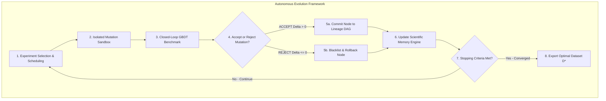
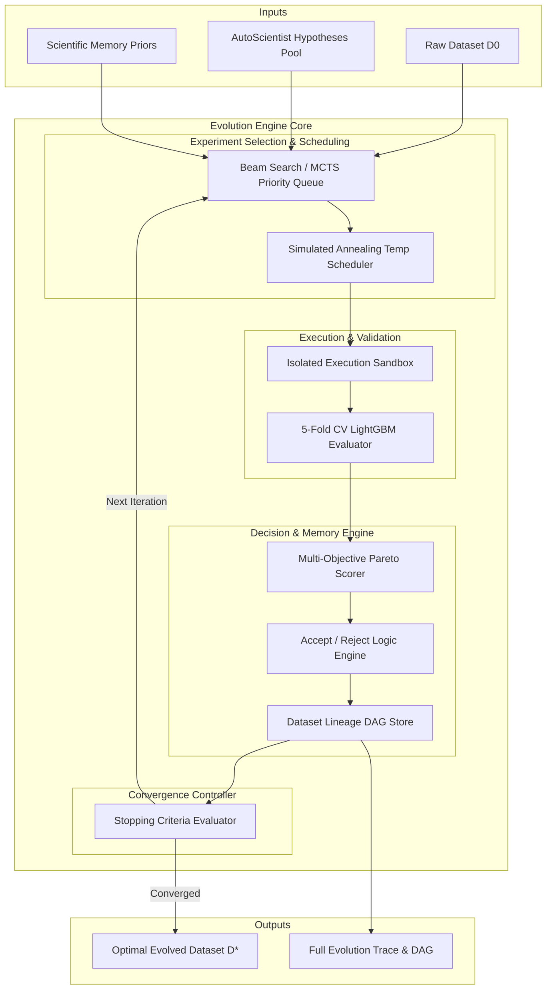
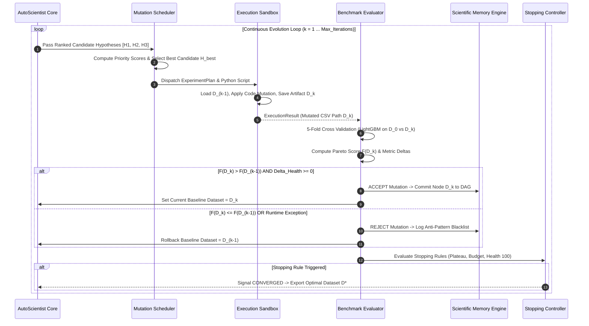
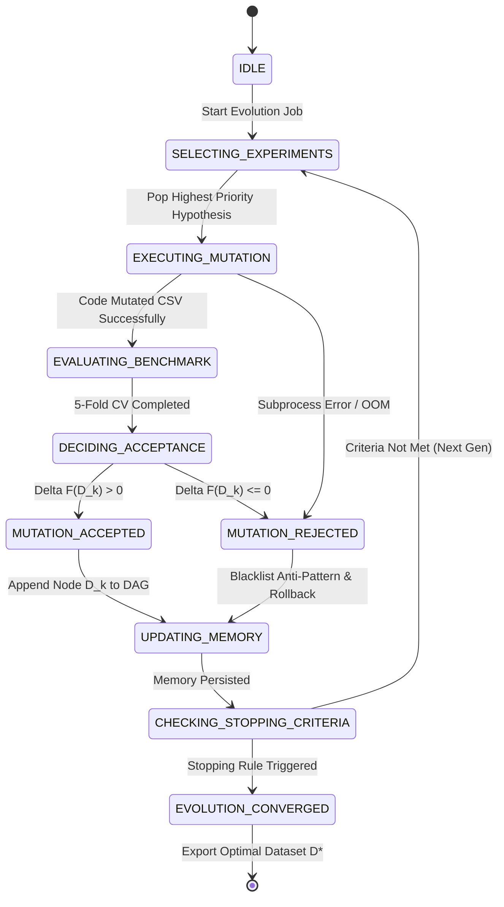

# EVOLUTION ENGINE
## Autonomous Dataset Evolution Framework Specification

---

| Metadata | Details |
| :--- | :--- |
| **System Module** | Evolution Engine |
| **Parent Platform** | Dataset Genome |
| **Specification Version** | `5.0.0-EVOLUTION-ENGINE-SPEC` |
| **Architectural Paradigm** | Autonomous Continuous Dataset Optimization (MCTS / Beam Search + Pareto Evaluation) |
| **Execution Framework** | Subprocess Sandbox / Isolated Worker Pool (Celery / Ray) |
| **Sprint Alignment** | Extended Sprint 4 Specification (Fully Compatible with Sprints 1, 2, AutoScientist Core & Memory Engine) |

---

## 1. Executive Summary & Evolutionary Philosophy

Traditional dataset preprocessing pipelines are static, linear, and manually crafted. The **Evolution Engine** transforms Dataset Genome into an **Autonomous Dataset Evolution Framework**. Rather than acting as a simple, passive code executor, the Evolution Engine continuously generates, prioritizes, executes, evaluates, accepts, rejects, and iterates over dataset mutations in a closed scientific feedback loop.

By viewing tabular datasets as dynamic genetic structures, the engine searches the combinatorial space of dataset transformations ($D_0 \to D_1 \to D_2 \dots \to D^*$) to find the Pareto-optimal dataset version $D^*$ that maximizes downstream machine learning model metrics (F1-score, ROC-AUC, RMSE) while improving overall statistical dataset health.



---

## 2. Framework Architecture



---

## 3. Continuous Dataset Evolution Cycle

The Evolution Engine executes continuous dataset optimization across multiple generational steps. Starting from raw baseline $D_0$, each generation $k$ explores alternative mutation branches, evaluating candidates against held-out validation folds.



---

## 4. Mutation Scheduling & Experiment Selection

The engine uses a **Beam Search with Simulated Annealing Temperature Decay** to schedule and prioritize experiments from the AutoScientist hypothesis candidate pool.

### Experiment Priority Function
For hypothesis $H_i$, priority score $P(H_i)$ is computed as:

$$P(H_i) = w_1 \cdot \text{PredictedDelta}(H_i) + w_2 \cdot c(H_i) + w_3 \cdot \text{MemoryPrior}(H_i)$$

Where $w_1 = 0.45, w_2 = 0.35, w_3 = 0.20$, and $c(H_i)$ is the confidence score from Component 6.

### Simulated Annealing Acceptance Temperature Decay
To prevent getting trapped in local optima, the engine occasionally accepts minor exploration mutations early in the search, with acceptance probability $P_{\text{accept}}$ decaying over generations:

$$P_{\text{accept}}(\Delta F, T_k) = \begin{cases} 1.0 & \text{if } \Delta F > 0 \\ \exp\left(\frac{\Delta F}{T_k}\right) & \text{if } \Delta F \le 0 \end{cases}$$

Where $T_k = T_0 \cdot \gamma^k$ (initial temperature $T_0 = 1.0$, decay rate $\gamma = 0.85$, generation $k$).

---

## 5. Decision Trees & Accept/Reject Logic

```mermaid
flowchart TD
    Start[New Mutated Dataset D_k Produced] --> CodeCheck{Did Python Script Execute Without Error?}
    
    CodeCheck -->|No: Runtime Exception / OOM| RejectError[REJECT: Mark EXECUTION_FAILED & Blacklist Code]
    CodeCheck -->|Yes: Mutated CSV Saved| DataCheck{Is Row Count Preserved & Target Column Intact?}
    
    DataCheck -->|No: Unintended Deletion| RejectIntegrity[REJECT: Mark DATA_INTEGRITY_VIOLATION]
    DataCheck -->|Yes| CVCheck[Run 5-Fold CV GBDT Baseline Benchmark]
    
    CVCheck --> ScoreComp{Compare Pareto Score F(D_k) vs F(D_baseline)}
    
    ScoreComp -->|F(D_k) > F(D_baseline)| HealthCheck{Is Health Score Delta >= 0?}
    ScoreComp -->|F(D_k) <= F(D_baseline)| TempCheck{Simulated Annealing Temp Pass?}
    
    HealthCheck -->|Yes| Accept[ACCEPT: Commit Node D_k to DAG & Update Baseline]
    HealthCheck -->|No: Health Degraded > 10%| RejectHealth[REJECT: Mark HEALTH_DEGRADATION]
    
    TempCheck -->|Yes| Accept
    TempCheck -->|No| RejectPerformance[REJECT: Mark METRIC_DEGRADATION]
```

---

## 6. Evaluation Algorithms & Pareto Scoring

The engine evaluates candidates across multiple objectives (Downstream Model Performance, Dataset Health Score, and Feature Parsimony) using a unified **Multi-Objective Pareto Fitness Function**:

$$F(D_k) = w_{\text{model}} \cdot \text{Metric}_{\text{norm}}(D_k) + w_{\text{health}} \cdot \frac{H(D_k)}{100} - w_{\text{parsimony}} \cdot \frac{|N_{\text{cols}}(D_k)|}{|N_{\text{cols}}(D_0)|}$$

Where:
- $w_{\text{model}} = 0.60$ (Downstream model validation accuracy/F1)
- $w_{\text{health}} = 0.30$ (Sprint 2 Dataset Health Score $0-100$)
- $w_{\text{parsimony}} = 0.10$ (Penalty for excessive feature expansion)

### 5-Fold Stratified Cross-Validation Algorithm
```python
def evaluate_dataset_fitness(df_baseline: pd.DataFrame, df_mutated: pd.DataFrame, target_col: str) -> float:
    # 1. Prepare Features & Target
    X_base, y_base = df_baseline.drop(columns=[target_col]), df_baseline[target_col]
    X_mut, y_mut = df_mutated.drop(columns=[target_col]), df_mutated[target_col]
    
    # 2. Setup Baseline LightGBM Model
    model = LGBMClassifier(n_estimators=100, random_state=42, verbose=-1)
    cv = StratifiedKFold(n_splits=5, shuffle=True, random_state=42)
    
    # 3. 5-Fold CV Evaluation on Mutated Dataset
    scores = cross_val_score(model, X_mut, y_mut, cv=cv, scoring='f1_weighted')
    mean_f1 = float(np.mean(scores))
    
    return mean_f1
```

---

## 7. Stopping Criteria & Convergence Controls

The continuous evolution framework terminates and declares convergence when **ANY** of the following 4 stopping rules are satisfied:

```
+-------------------------------------------------------------------------+
|                        STOPPING CRITERIA MATRIX                         |
+-------------------------------------------------------------------------+
|                                                                         |
|  Rule 1: Metric Plateau     --> No >= 0.5% gain over 3 consecutive steps|
|  Rule 2: Max Depth Ceiling  --> Iteration step k == k_max (default: 10) |
|  Rule 3: Compute Budget     --> Total evolution runtime >= Max_Time     |
|  Rule 4: Optimal Health     --> Health Score == 100.0 & 0 Critical Issues|
|                                                                         |
+-------------------------------------------------------------------------+
```

---

## 8. State Machine Diagram



---

## 9. Integration with Scientific Memory Engine

The Evolution Engine synchronizes state with the **Scientific Memory Engine** at every generation:

1. **DAG Version Graph**: Each accepted mutation appends a new node $D_k$ with content hash, parent pointer, and metric deltas.
2. **Recipe Indexing**: Upon `MUTATION_ACCEPTED`, the transformation code snippet is indexed into the semantic vector store.
3. **Anti-Pattern Blacklisting**: Upon `MUTATION_REJECTED`, the parameter combination is written to the memory blacklist to prevent repeat attempts on identical dataset states.
4. **Prior Belief Updates**: Updates Bayesian confidence priors $\text{Beta}(\alpha, \beta)$ for the executed operator type.

---

## 10. API Contracts

### Endpoint 10.1: `POST /evolution/start`
- **Summary**: Launch an autonomous continuous dataset evolution job.
- **Request Payload**: `POST /evolution/start`
```json
{
  "dataset_id": "5a7becd4-eae8-46b5-af4d-f75b46e0448f",
  "target_column": "TriageScore",
  "max_iterations": 10,
  "max_time_seconds": 300,
  "optimization_target": "f1_score"
}
```
- **Response**: `202 Accepted`
```json
{
  "evolution_job_id": "job_77f109ab",
  "dataset_id": "5a7becd4-eae8-46b5-af4d-f75b46e0448f",
  "status": "EVOLUTION_STARTED",
  "initial_health_score": 82.4,
  "estimated_completion_seconds": 120
}
```

---

### Endpoint 10.2: `GET /evolution/status/{evolution_job_id}`
- **Summary**: Retrieve real-time progress, generation history, and Pareto score curves.
- **Response**: `200 OK`
```json
{
  "evolution_job_id": "job_77f109ab",
  "status": "RUNNING",
  "current_generation": 4,
  "max_iterations": 10,
  "baseline_f1": 0.812,
  "current_best_f1": 0.889,
  "health_score_delta": 12.2,
  "generations": [
    {
      "step": 1,
      "operator": "KNN_IMPUTE(RegistrationTime)",
      "status": "ACCEPTED",
      "f1_score": 0.854,
      "health_score": 87.2
    },
    {
      "step": 2,
      "operator": "WINSORIZE(Age, limits=[0.01, 0.01])",
      "status": "REJECTED",
      "f1_score": 0.849,
      "health_score": 87.0
    },
    {
      "step": 3,
      "operator": "PruneMulticollinear(IsOnlineBooking)",
      "status": "ACCEPTED",
      "f1_score": 0.889,
      "health_score": 94.6
    }
  ]
}
```

---

### Endpoint 10.3: `POST /evolution/rollback`
- **Summary**: Rollback current dataset baseline to a specific node in the DAG lineage tree.
- **Request Payload**: `POST /evolution/rollback`
```json
{
  "dataset_id": "5a7becd4-eae8-46b5-af4d-f75b46e0448f",
  "target_node_id": "D1_imputed"
}
```
- **Response**: `200 OK`
```json
{
  "dataset_id": "5a7becd4-eae8-46b5-af4d-f75b46e0448f",
  "active_node_id": "D1_imputed",
  "status": "ROLLED_BACK_SUCCESSFULLY"
}
```

---

## 11. Engineering Notes

1. **Worker Isolation**: Experiments execute inside worker processes with fixed memory limits (`RLIMIT_AS`) and maximum CPU execution timeouts (`SIGXCPU`).
2. **Parallel Candidate Scheduling**: Independent mutation branches (mutations affecting non-overlapping column sets) are executed in parallel across worker pools.
3. **State Checkpointing**: Dataset version CSV artifacts $D_0, D_1 \dots$ are compressed with `gzip` on disk to minimize storage consumption.
4. **Deterministic Seed Control**: All model evaluations utilize fixed random seeds (`random_state=42`) across cross-validation splits to eliminate stochastic noise from metric delta calculations.

---
*End of Evolution Engine Architecture Specification*
