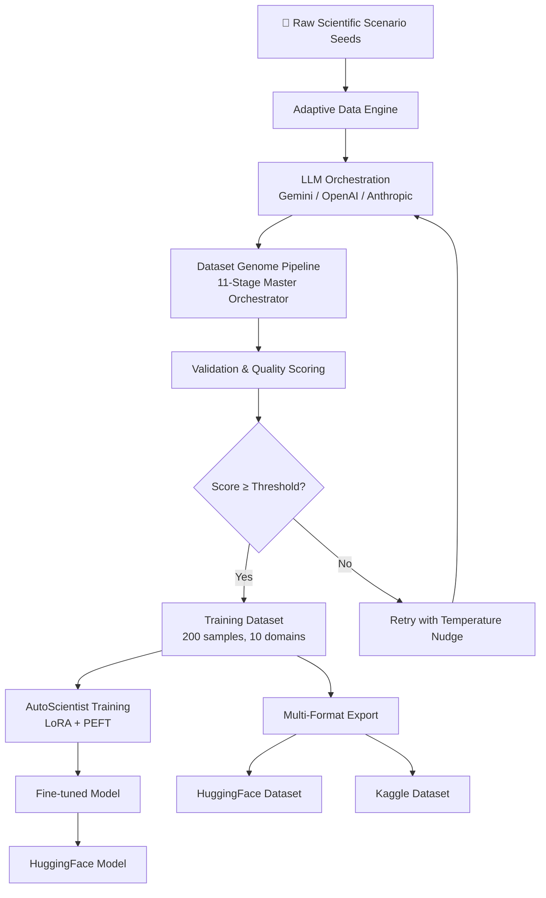
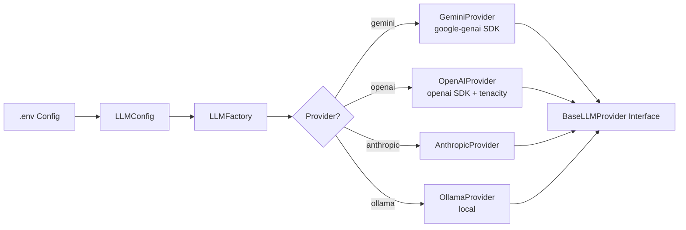
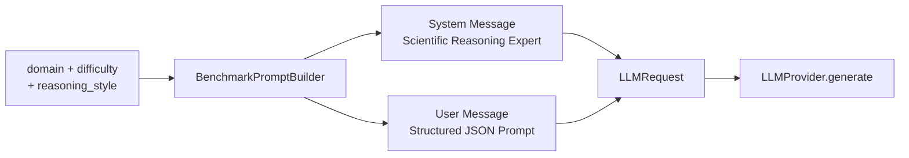
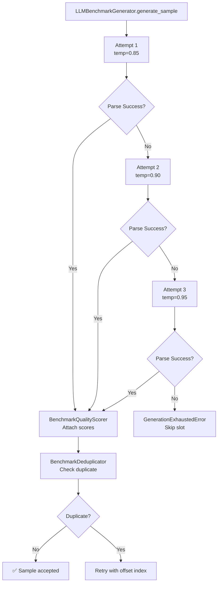
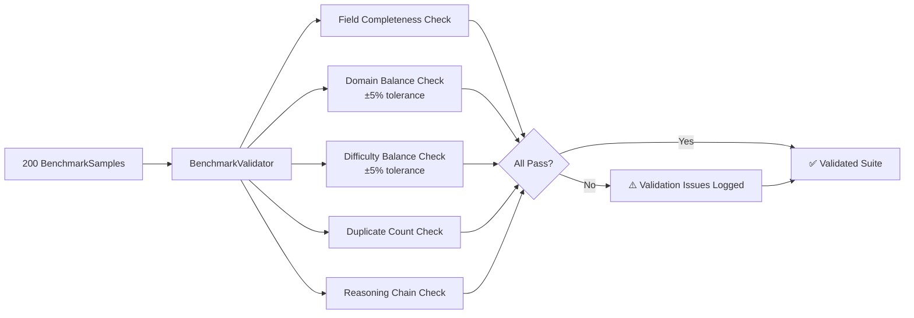
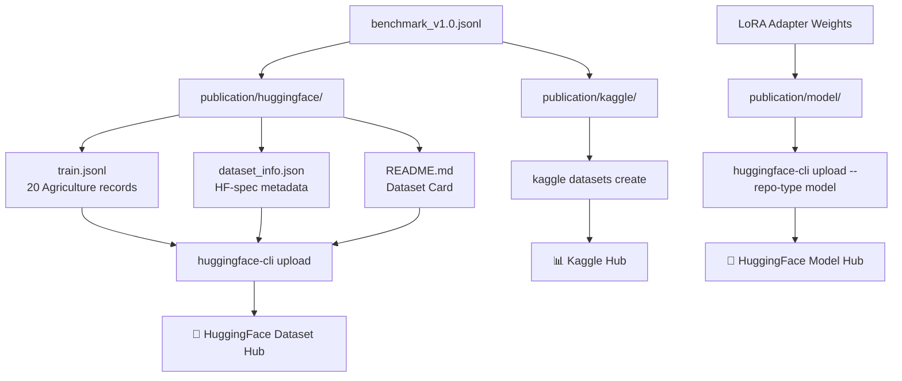

# End-to-End Project Flow

## Overview

This document traces the complete Dataset Genome pipeline from initialization to published artifacts, with detailed Mermaid diagrams at each stage.

---

## High-Level Flow



---

## Stage 1: LLM Provider Initialization



**Key files:**
- [`backend/app/llm/config.py`](../backend/app/llm/config.py) — reads `GOOGLE_API_KEY`, `OPENAI_API_KEY` from env
- [`backend/app/llm/factory.py`](../backend/app/llm/factory.py) — `LLMFactory.get_provider()`
- [`backend/app/llm/providers/`](../backend/app/llm/providers/) — concrete implementations

---

## Stage 2: Benchmark Prompt Construction



**Key files:**
- [`backend/app/benchmark/prompt_builder.py`](../backend/app/benchmark/prompt_builder.py)
- [`backend/app/llm/models.py`](../backend/app/llm/models.py) — `LLMRequest`

---

## Stage 3: Sample Generation with Retry Logic



**Key files:**
- [`backend/app/benchmark/llm_generator.py`](../backend/app/benchmark/llm_generator.py)
- [`backend/app/benchmark/response_parser.py`](../backend/app/benchmark/response_parser.py)
- [`backend/app/benchmark/quality_scorer.py`](../backend/app/benchmark/quality_scorer.py)
- [`backend/app/benchmark/deduplicator.py`](../backend/app/benchmark/deduplicator.py)

---

## Stage 4: Suite Validation



**Key files:**
- [`backend/app/benchmark/validator.py`](../backend/app/benchmark/validator.py)

---

## Stage 5: 11-Stage Master Orchestrator

The `DatasetGenomeMasterPipeline` orchestrates all stages:

| Stage | Name | Description |
|-------|------|-------------|
| 1 | Initialization | Pipeline config, export dir setup |
| 2 | LLM Provider | Factory instantiation, API key validation |
| 3 | Dataset Generation | Benchmark sample generation across all domains |
| 4 | Validation | Suite validation (domain/difficulty balance, dedup) |
| 5 | Quality Scoring | Composite adaptive score calculation |
| 6 | JSON Export | Structured JSON archive |
| 7 | JSONL Export | Training-format JSONL |
| 8 | CSV Export | Tabular CSV |
| 9 | Parquet Export | Columnar Parquet (via pyarrow) |
| 10 | HuggingFace Export | HF-ready JSON + dataset card |
| 11 | Reporting | Benchmark report, diversity report, leaderboard, manifest |

**Key files:**
- [`backend/app/pipeline/master_orchestrator.py`](../backend/app/pipeline/master_orchestrator.py)

---

## Stage 6: Publication



---

## Running the Full Pipeline

```bash
# 1. Clone and configure
git clone <repo-url>
cd dataset_genome
cp .env.example .env
# Fill in GOOGLE_API_KEY

# 2. Install dependencies
pip install -r requirements.txt

# 3. Run demo (full 11-stage pipeline)
python demo.py

# 4. Review outputs
ls export_benchmark/
# benchmark_v1.0.jsonl, benchmark_report.md, reproducibility_manifest.json, ...
```

---

## Output Artifacts

After running `demo.py`:

| Artifact | Location | Description |
|----------|----------|-------------|
| Full benchmark | `export_benchmark/benchmark_v1.0.jsonl` | 200 samples, JSONL |
| Quality report | `export_benchmark/benchmark_report.json` | Adaptive score, coverage metrics |
| Reproducibility manifest | `export_benchmark/reproducibility_manifest.json` | Git hash, seed, provider |
| Leaderboard | `export_benchmark/benchmark_leaderboard.json` | Version ranking |
| Diversity report | `export_benchmark/dataset_diversity_report.json` | Lexical diversity metrics |
| Dashboard data | `export_benchmark/live_pipeline_status.json` | Frontend analytics |
| HF package | `publication/huggingface/` | Ready to upload |

---

*See [`architecture.md`](architecture.md) for system architecture, [`benchmark.md`](benchmark.md) for quality metrics, and [`publication.md`](publication.md) for upload instructions.*
