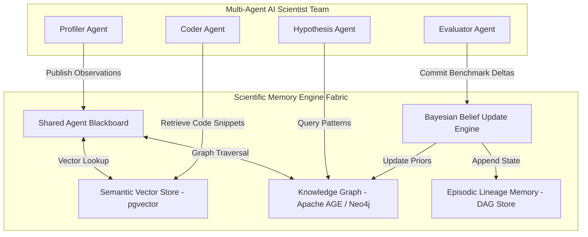
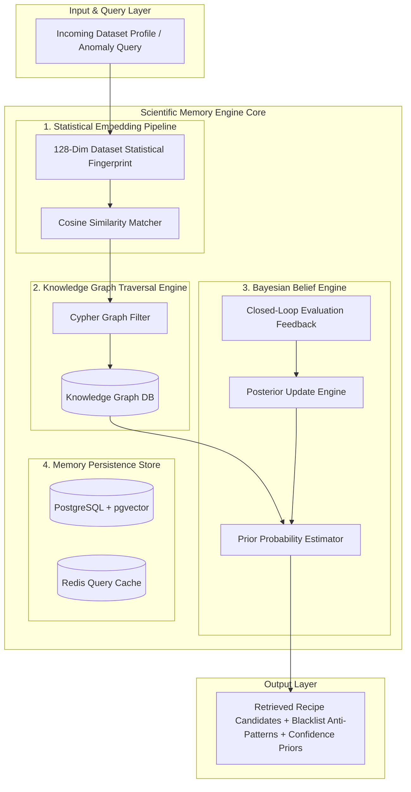
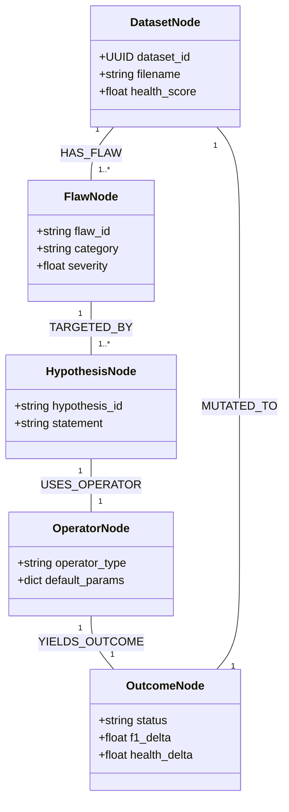
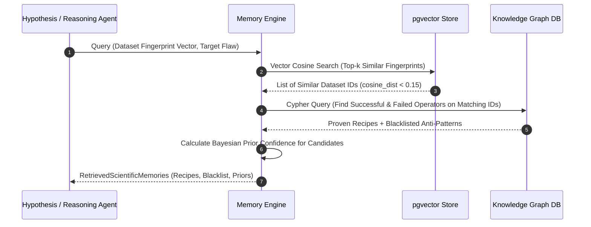
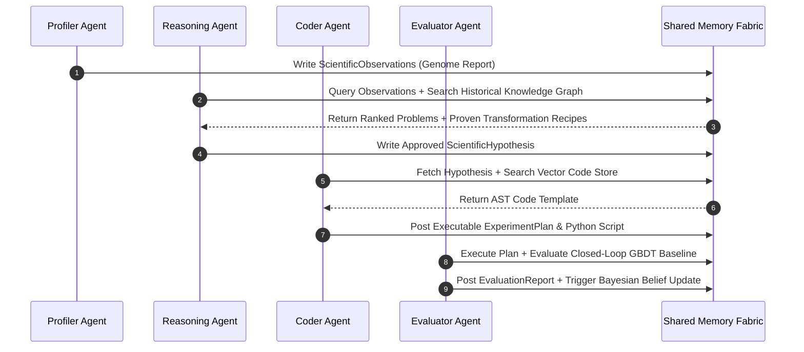

# SCIENTIFIC MEMORY ENGINE
## Advanced Autonomous Memory, Knowledge Graph & Multi-Agent Intelligence Specification

---

| Metadata | Details |
| :--- | :--- |
| **System Module** | Scientific Memory Engine |
| **Parent Platform** | Dataset Genome |
| **Specification Version** | `4.0.0-MEMORY-ENGINE-SPEC` |
| **Architectural Paradigm** | Shared Multi-Agent Memory Fabric (Hybrid Vector Search + Knowledge Graph + Bayesian Belief Updates) |
| **Database Tech** | PostgreSQL + `pgvector` + Apache AGE (Graph Engine) / Redis Cache |
| **Sprint Alignment** | Extended Sprint 3–6 Specification (Fully Compatible with Sprints 1, 2 & AutoScientist Core) |

---

## 1. Executive Summary & Scientific Rationale

In autonomous scientific discovery, an AI agent without long-term memory is forced to re-invent transformation strategies from scratch for every new dataset, repeating past failures and missing systemic data evolution patterns. The **Scientific Memory Engine** is the persistent intelligence backbone of Dataset Genome. It enables the AutoScientist Core—and future multi-agent AI scientist teams—to remember every observation, hypothesis, code mutation, execution outcome, and benchmark metric delta across all dataset runs.

The Scientific Memory Engine unifies three memory subsystems:
1. **Episodic Lineage Memory**: Immutable Directed Acyclic Graph (DAG) tracking dataset mutation versions ($D_0 \to D_1 \to D_2$) with rollback capabilities.
2. **Semantic Vector Memory**: High-dimensional embedding space representing statistical dataset fingerprints and transformation recipes for similarity search.
3. **Structured Knowledge Graph**: Graph database mapping relationships between statistical flaws, hypotheses, mutation operators, and downstream ML metric improvements.



---

## 2. System Architecture



---

## 3. Experiment Memory Schema & Database Schema

The persistence layer uses **PostgreSQL** with the **`pgvector`** extension for vector similarity search and **Apache AGE / Cypher** for knowledge graph queries.

```sql
-- PostgreSQL + pgvector Extension Setup
CREATE EXTENSION IF NOT EXISTS "uuid-ossp";
CREATE EXTENSION IF NOT EXISTS "vector";

-- 1. Dataset Fingerprints Table
CREATE TABLE dataset_fingerprints (
    id UUID PRIMARY KEY DEFAULT uuid_generate_v4(),
    dataset_id UUID NOT NULL,
    filename VARCHAR(255) NOT NULL,
    num_rows INT NOT NULL,
    num_cols INT NOT NULL,
    completeness_score FLOAT NOT NULL,
    consistency_score FLOAT NOT NULL,
    balance_score FLOAT NOT NULL,
    noise_score FLOAT NOT NULL,
    correlation_score FLOAT NOT NULL,
    feature_quality_score FLOAT NOT NULL,
    overall_health_score FLOAT NOT NULL,
    fingerprint_vector vector(128) NOT NULL, -- Normalized statistical embedding
    created_at TIMESTAMP WITH TIME ZONE DEFAULT CURRENT_TIMESTAMP
);

-- 2. Experiment Memory Records Table
CREATE TABLE experiment_memory_records (
    id UUID PRIMARY KEY DEFAULT uuid_generate_v4(),
    parent_experiment_id UUID REFERENCES experiment_memory_records(id),
    dataset_id UUID NOT NULL,
    iteration_step INT NOT NULL,
    observation_type VARCHAR(100) NOT NULL,
    target_column VARCHAR(100),
    hypothesis_statement TEXT NOT NULL,
    transformation_type VARCHAR(100) NOT NULL,
    mutation_parameters JSONB NOT NULL,
    python_script TEXT NOT NULL,
    execution_status VARCHAR(50) NOT NULL, -- 'SUCCESS', 'AST_ERROR', 'RUNTIME_ERROR', 'OOM'
    execution_latency_ms FLOAT NOT NULL,
    validation_status VARCHAR(50) NOT NULL, -- 'CONFIRMED', 'FALSIFIED', 'REJECTED_LOW_CONFIDENCE'
    baseline_metric_val FLOAT NOT NULL,
    mutated_metric_val FLOAT NOT NULL,
    metric_delta FLOAT NOT NULL,
    health_score_delta FLOAT NOT NULL,
    bayesian_confidence_prior FLOAT NOT NULL,
    bayesian_confidence_posterior FLOAT NOT NULL,
    created_at TIMESTAMP WITH TIME ZONE DEFAULT CURRENT_TIMESTAMP
);

-- HNSW Vector Index for fast similarity search
CREATE INDEX idx_fingerprint_vector ON dataset_fingerprints 
USING hnsw (fingerprint_vector vector_cosine_ops) WITH (m = 16, ef_construction = 64);
```

### Python Pydantic Schema
```python
from typing import Dict, List, Any, Optional
from uuid import UUID
from datetime import datetime
from pydantic import BaseModel, Field

class ExperimentMemoryRecord(BaseModel):
    id: UUID
    parent_experiment_id: Optional[UUID] = None
    dataset_id: UUID
    iteration_step: int
    observation_type: str
    target_column: Optional[str] = None
    hypothesis_statement: str
    transformation_type: str
    mutation_parameters: Dict[str, Any]
    python_script: str
    execution_status: str  # SUCCESS, RUNTIME_ERROR, OOM
    validation_status: str # CONFIRMED, FALSIFIED, REJECTED
    metric_delta: float
    health_score_delta: float
    confidence_prior: float
    confidence_posterior: float
    created_at: datetime = Field(default_factory=datetime.utcnow)
```

---

## 4. Knowledge Graph Architecture

The **Knowledge Graph** models semantic relationships between datasets, statistical flaws, hypotheses, operators, and validation outcomes.



### Graph Cypher Query Example (Finding Successful Recipes)
```cypher
MATCH (d:DatasetNode)-[:HAS_FLAW]->(f:FlawNode {category: 'completeness'})
MATCH (f)-[:TARGETED_BY]->(h:HypothesisNode)-[:USES_OPERATOR]->(op:OperatorNode)
MATCH (op)-[:YIELDS_OUTCOME]->(out:OutcomeNode {status: 'CONFIRMED'})
WHERE out.f1_delta > 0.03
RETURN op.operator_type, op.default_params, AVG(out.f1_delta) AS avg_gain
ORDER BY avg_gain DESC LIMIT 5;
```

---

## 5. Memory Retrieval Process & Similarity Search



### Mathematical Similarity Formulation
Given a target dataset statistical fingerprint vector $\mathbf{u} \in \mathbb{R}^{128}$ and stored dataset vector $\mathbf{v} \in \mathbb{R}^{128}$:

$$S_{\text{cosine}}(\mathbf{u}, \mathbf{v}) = \frac{\mathbf{u} \cdot \mathbf{v}}{\|\mathbf{u}\| \|\mathbf{v}\|} = \frac{\sum_{i=1}^{128} u_i v_i}{\sqrt{\sum_{i=1}^{128} u_i^2} \sqrt{\sum_{i=1}^{128} v_i^2}}$$

Hybrid Retrieval Score:
$$S_{\text{hybrid}}(\mathbf{u}, \mathbf{v}, H_k) = \mu \cdot S_{\text{cosine}}(\mathbf{u}, \mathbf{v}) + (1 - \mu) \cdot P_{\text{prior}}(\text{Success} \mid H_k)$$
Where $\mu = 0.6$.

---

## 6. Failed & Successful Experiment Storage

### 6.1 Successful Experiment Storage (Positive Transfer)
- **Criteria**: $\Delta \text{Downstream Metric} > 0$ and $\Delta \text{Health Score} \ge 0$.
- **Storage Action**:
  1. Save AST Python snippet into vector store as an approved transformation recipe.
  2. Increase Bayesian posterior confidence for `(flaw_type, operator_type)` pair.
  3. Create `YIELDS_OUTCOME {status: 'CONFIRMED'}` edge in Knowledge Graph.

### 6.2 Failed Experiment Storage (Anti-Pattern Blacklist)
- **Criteria**: Runtime Error / AST Exception OR $\Delta \text{Downstream Metric} \le 0$ OR $\Delta \text{Health Score} < -5.0$.
- **Storage Action**:
  1. Append transformation code and parameter combination to current session **Blacklist**.
  2. Decrease Bayesian posterior confidence score.
  3. Create `YIELDS_OUTCOME {status: 'FALSIFIED', failure_reason: 'METRIC_DEGRADATION'}` edge in Knowledge Graph.
  4. Ensure Reasoning Agent never generates identical hypothesis for the same dataset branch.

---

## 7. Confidence Updates & Learning Mechanism

The Scientific Memory Engine employs an **Online Bayesian Belief Update Mechanism** to refine operator confidence over time.

### Bayesian Formulation
Let $H_k$ be a hypothesis proposing operator $M$ for statistical flaw $F$. The posterior probability of success $P(S \mid F, M)$ is updated after each closed-loop evaluation:

$$P(S \mid F, M)_{\text{new}} = \frac{P(\text{Eval} \mid S) \cdot P(S \mid F, M)_{\text{old}}}{P(\text{Eval})}$$

Using a Beta-Binomial conjugate prior model:
$$\text{Prior}: \text{Beta}(\alpha_0, \beta_0)$$
Upon Observing Success ($k = 1$): $\alpha_{\text{new}} = \alpha + 1, \quad \beta_{\text{new}} = \beta$
Upon Observing Failure ($k = 0$): $\alpha_{\text{new}} = \alpha, \quad \beta_{\text{new}} = \beta + 1$

Expected Confidence Prior:
$$E[\text{Confidence}] = \frac{\alpha}{\alpha + \beta}$$

---

## 8. Version History & Dataset Lineage DAG

Every dataset mutation creates an immutable node in the **Dataset Lineage DAG**:


### DAG Lineage Properties
- **Immutability**: Raw $D_0$ and intermediate CSVs $D_1, D_2 \dots$ are stored with unique SHA-256 content hashes.
- **Rollback Capability**: If step $k$ yields metric degradation, engine rolls back to parent node $D_{k-1}$ in the DAG and explores alternative mutation branches.
- **Reproducibility**: Complete pipeline sequence can be replayed from $D_0$ to $D_{\text{final}}$ using recorded commit hashes.

---

## 9. Multi-Agent AI Scientist Integration

The Scientific Memory Engine serves as the **Shared Blackboard Architecture** for multi-agent scientist collaboration.



---

## 10. API Contracts

### Endpoint 10.1: `POST /memory/query`
- **Summary**: Perform hybrid vector & graph similarity search for recipes and anti-patterns.
- **Request Payload**: `POST /memory/query`
```json
{
  "dataset_id": "5a7becd4-eae8-46b5-af4d-f75b46e0448f",
  "observation_category": "completeness",
  "affected_column": "RegistrationTime",
  "top_k": 3
}
```
- **Response**: `200 OK`
```json
{
  "dataset_id": "5a7becd4-eae8-46b5-af4d-f75b46e0448f",
  "retrieved_recipes": [
    {
      "recipe_id": "rec_88f91a2b",
      "transformation_type": "KNN_IMPUTE",
      "recommended_parameters": { "n_neighbors": 5, "weights": "uniform" },
      "historical_success_rate": 0.88,
      "average_f1_gain": 0.042,
      "sample_python_code": "from sklearn.impute import KNNImputer\nimputer = KNNImputer(n_neighbors=5)\ndf[['RegistrationTime']] = imputer.fit_transform(df[['RegistrationTime']])"
    }
  ],
  "blacklisted_anti_patterns": [
    {
      "transformation_type": "DROP_COLUMN",
      "reason": "Excessive information loss when column correlation with target > 0.40"
    }
  ]
}
```

---

### Endpoint 10.2: `POST /memory/store`
- **Summary**: Persist experiment execution and evaluation results to memory, updating Bayesian belief priors.
- **Request Payload**: `POST /memory/store`
```json
{
  "dataset_id": "5a7becd4-eae8-46b5-af4d-f75b46e0448f",
  "parent_experiment_id": "exp_102a9b3c",
  "iteration_step": 2,
  "observation_type": "completeness",
  "target_column": "RegistrationTime",
  "hypothesis_statement": "Imputing RegistrationTime using KNN (k=5) preserves feature interaction.",
  "transformation_type": "KNN_IMPUTE",
  "mutation_parameters": { "n_neighbors": 5 },
  "python_script": "import pandas as pd\nfrom sklearn.impute import KNNImputer...",
  "execution_status": "SUCCESS",
  "execution_latency_ms": 342.5,
  "validation_status": "CONFIRMED",
  "baseline_metric_val": 0.812,
  "mutated_metric_val": 0.854,
  "metric_delta": 0.042,
  "health_score_delta": 4.8
}
```
- **Response**: `201 Created`
```json
{
  "memory_record_id": "rec_99d102ab",
  "updated_prior_alpha": 12,
  "updated_prior_beta": 2,
  "new_confidence_score": 0.857,
  "status": "MEMORY_PERSISTED_SUCCESSFULLY"
}
```

---

### Endpoint 10.3: `GET /memory/lineage/{dataset_id}`
- **Summary**: Retrieve complete dataset mutation lineage DAG tree.
- **Response**: `200 OK`
```json
{
  "dataset_id": "5a7becd4-eae8-46b5-af4d-f75b46e0448f",
  "root_node": "D0_raw",
  "lineage_dag": [
    {
      "node_id": "D0_raw",
      "parent_id": null,
      "health_score": 82.4,
      "model_f1_score": 0.812,
      "status": "BASELINE"
    },
    {
      "node_id": "D1_imputed",
      "parent_id": "D0_raw",
      "transformation": "KNN_IMPUTE(RegistrationTime)",
      "health_score": 87.2,
      "model_f1_score": 0.854,
      "status": "ACCEPTED"
    },
    {
      "node_id": "D2_evolved",
      "parent_id": "D1_imputed",
      "transformation": "PruneMulticollinear(IsOnlineBooking)",
      "health_score": 94.6,
      "model_f1_score": 0.889,
      "status": "OPTIMAL_FINAL"
    }
  ]
}
```

---

## 11. Engineering Notes

1. **Vector HNSW Indexing Tuning**: The `pgvector` HNSW index is created with `m = 16` and `ef_construction = 64`. Search queries set `ef_search = 40` to maintain sub-10ms similarity lookup times over $1,000,000+$ stored dataset profiles.
2. **Concurrency & Thread Safety**: Memory updates execute inside transactional database connections (`BEGIN ... COMMIT`) with optimistic locking on Bayesian prior records (`SELECT ... FOR UPDATE`).
3. **Redis Query Caching**: Top-ranked transformation recipes for standard dataset profiles are cached in Redis with a 1-hour Time-To-Live (TTL) to achieve $< 2\text{ms}$ retrieval latencies.
4. **DAG Rollback Integrity**: Rolling back to a parent dataset node does not delete child branches; failed branches are marked `PRUNED` in the DAG to preserve complete scientific auditability.

---
*End of Scientific Memory Engine Technical Specification*
