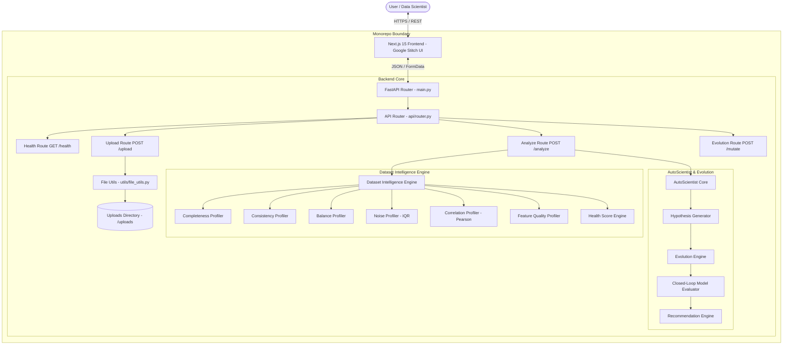
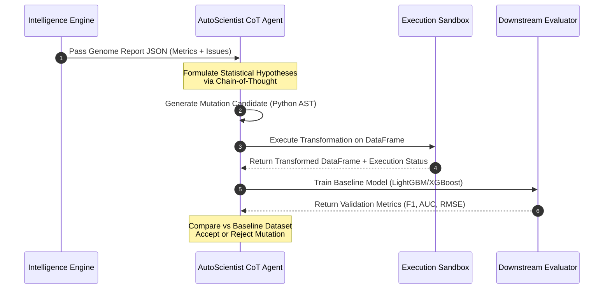
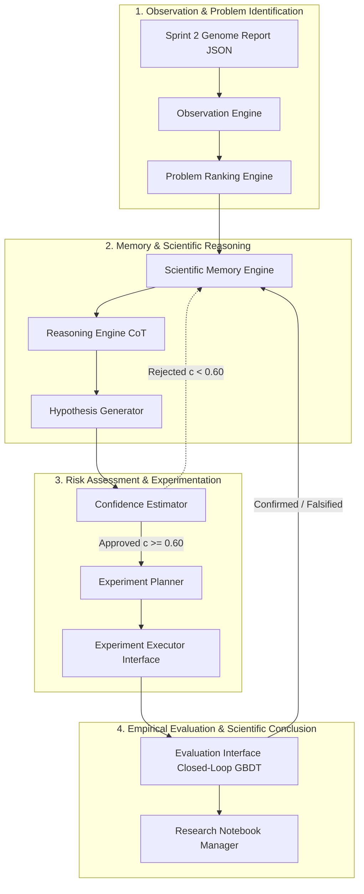
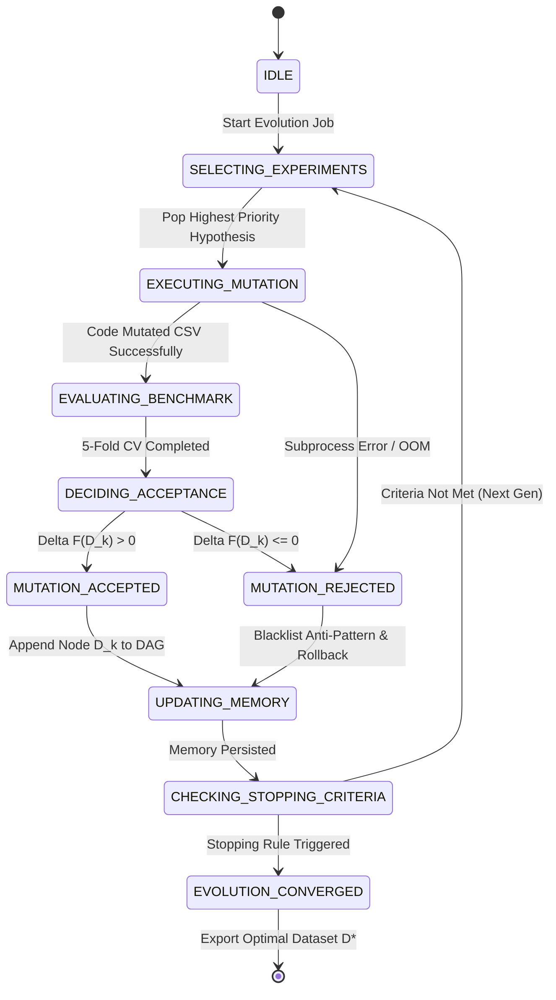
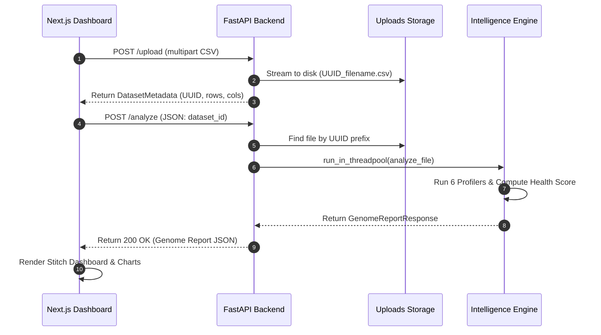
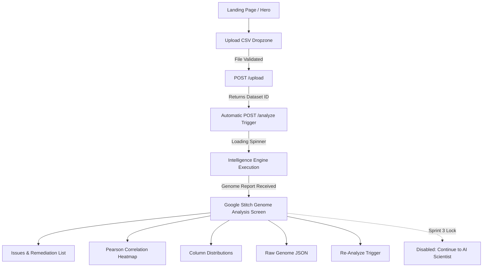

# DATASET GENOME
## Technical Architecture & Production Engineering Specification
**An Autonomous Dataset Evolution Framework for Data-Centric AI**

---

| Metadata | Details |
| :--- | :--- |
| **Project Name** | Dataset Genome |
| **Tagline** | An Autonomous Dataset Evolution Framework for Data-Centric AI |
| **Track Alignment** | HackIndia Adaption AutoScientist Challenge |
| **Document Version** | `2.0.0-PROD-SPEC` |
| **Classification** | Internal Technical Architecture Document (Series-A Production Grade) |
| **Authors** | Principal AI Research Architect, Staff Software Architect |
| **Status** | Approved Specification (Sprints 1 & 2 Live; Sprints 3–6 Roadmap) |

---

## 1. Executive Summary

Modern Machine Learning engineering is undergoing a fundamental paradigm shift from **Model-Centric AI** to **Data-Centric AI (DCAI)**. While the research community has established standardized automated hyperparameter tuning (AutoML), Neural Architecture Search (NAS), and model optimization frameworks, the underlying dataset remains a predominantly manual, unstandardized, and error-prone artifact. Data scientists spend upwards of 80% of their operational bandwidth inspecting, cleaning, imputing, and transforming tabular datasets via ad-hoc, unversioned Jupyter Notebooks.

**Dataset Genome** is an autonomous AI Scientist framework designed to formalize and automate data-centric optimization. Instead of searching model architecture space over static data, Dataset Genome treats the dataset as a dynamic, evolvable mathematical structure. Formally, given an initial raw dataset $D_0 \in \mathcal{D}$ and a space of valid code mutation operators $\mathcal{M}$, Dataset Genome seeks the Pareto-optimal dataset version $D^*$ that maximizes downstream model performance and statistical health:

$$D^* = \arg\max_{D \in \mathcal{M}(D_0)} \left[ \mathcal{L}_{\text{downstream}}(f_\theta(D)) + \lambda \cdot H(D) \right]$$

By computing a multi-dimensional **Genome Report** (measuring Completeness, Consistency, Balance, Noise, Correlation, and Feature Quality) and orchestrating an autonomous **Scientific Method Loop** (Observation → Problem Ranking → Memory Lookup → Reasoning → Hypothesis → Confidence Estimation → AST Code Planning → Sandboxed Execution → Closed-Loop Evaluation → Lineage Commit), Dataset Genome iteratively mutates tabular datasets to achieve empirical metric improvements while maintaining strict pipeline reproducibility.

---

## 2. Vision & Challenge Alignment

The vision of Dataset Genome is to establish the global open standard for **Autonomous Dataset Evolution**. Just as biological genome sequencing unlocked precision medicine by making DNA self-describing, actionable, and evolvable, Dataset Genome makes tabular datasets self-describing, self-diagnosing, self-repairing, and self-improving.

```
       +-------------------------------------------------------------------+
       |                 THE AUTONOMOUS SCIENTIFIC METHOD                  |
       +-------------------------------------------------------------------+
                                         |
                                         v
   +-------------------+       +-------------------+       +-------------------+
   |   OBSERVATION     | ----> |    HYPOTHESIS     | ----> |    EXPERIMENT     |
   | (Genome Profiler) |       | (AutoScientist)   |       | (Evolution Loop)  |
   +-------------------+       +-------------------+       +-------------------+
             ^                                                       |
             |                       EVALUATION                      |
             +------------------ (Downstream Benchmark) <------------+
```

### Strategic Alignment with HackIndia Adaption AutoScientist Challenge

Dataset Genome directly addresses the core pillars of the AutoScientist challenge:
1. **Adaptive Data Representation**: Datasets dynamically adapt their statistical distributions, missingness representations, and feature dimensions based on empirical validation signals.
2. **AutoScientist Reasoning**: Operates as an autonomous scientific agent that generates data-centric hypotheses, executes AST-validated Python code mutations, and learns from experiment results without human intervention.
3. **Scientific Chain-of-Thought (CoT)**: Formulates causal hypotheses grounded in empirical statistical evidence (IQR quantiles, Pearson $r$ matrices, Shannon entropy) rather than uncalibrated LLM guessing.
4. **Closed-Loop Empirical Experimentation**: Executes closed-loop benchmark trials using gradient boosted decision tree baselines (LightGBM/XGBoost) to evaluate whether a dataset mutation yields statistically significant distribution improvement.
5. **Dataset Lineage & Evolution**: Tracks versioned dataset mutations as a Directed Acyclic Graph (DAG) lineage tree (`v1.2.1-sha256:7a8b`), enabling reproducible rollback and Pareto-optimal feature selection.

---

## 3. Problem Statement

Data-Centric AI currently suffers from four structural engineering and scientific bottlenecks:

1. **The Wrangling Sinkhole**: Tabular data cleaning is conducted imperatively inside unstructured Jupyter Notebooks. Transformation logic is rarely documented, versioned, or unit-tested, causing non-reproducible ML pipelines.
2. **Heuristic Guesswork vs. Systematic Hypotheses**: Preprocessing choices (e.g., mean imputation vs. KNN/MICE, Winsorization vs. trimming) are selected arbitrarily without formal statistical hypothesis testing or closed-loop evaluation against held-out validation metrics.
3. **Silent Statistical Failure Modes**: Tabular datasets frequently contain undetected flaws—severe multicollinearity ($|r| \ge 0.85$), zero-variance constant features, extreme class imbalance (majority class ratio $\ge 0.85$), and statistical noise ($IQR$ outliers)—that silently induce data leakage and degrade model generalization.
4. **Static Datasets in Dynamic Environments**: Once ingested into an ML pipeline, datasets remain static artifacts. There is no automated framework to continuously evolve feature representations as target distributions shift.

---

## 4. Research Gap

Existing data profiling tools and AutoML frameworks address isolated fragments of the data lifecycle but fail to deliver an integrated, self-evolving data-centric system.

| Feature / Capability | Hugging Face Cards | ydata-profiling | Great Expectations | AutoML (H2O / Auto-sklearn) | Dataset Genome |
| :--- | :---: | :---: | :---: | :---: | :---: |
| **Structural Profiling** | ❌ Manual | ✅ Static HTML | ⚠️ Rule-based | ⚠️ Basic | ✅ **Automated Genome API** |
| **Statistical Health Scoring** | ❌ None | ❌ None | ❌ None | ❌ None | ✅ **Weighted 6-Axis Engine** |
| **AI Hypothesis Generation** | ❌ None | ❌ None | ❌ None | ❌ None | ✅ **AutoScientist CoT Engine** |
| **Autonomous Mutation Execution** | ❌ None | ❌ None | ❌ None | ⚠️ Model-only | ✅ **Dataset Evolution Loop** |
| **Closed-Loop Model Evaluation** | ❌ None | ❌ None | ❌ None | ✅ Yes | ✅ **Dataset-Centric Benchmark** |
| **Vector & Graph Scientific Memory** | ❌ None | ❌ None | ❌ None | ❌ None | ✅ **pgvector + Graph Engine** |
| **Content-Addressable Lineage DAG** | ❌ None | ❌ None | ❌ None | ❌ None | ✅ **Git-like DAG (SHA-256)** |
| **Exportable Pipeline Code** | ❌ None | ❌ None | ⚠️ Expectation JSON | ❌ None | ✅ **Executable Python Script** |

---

## 5. Competitor Analysis

```
                                AUTONOMY LEVEL
                                      ^
                                      |              Dataset Genome
                                      |                    *
                                      |
                       AutoML Systems |
                            *         |
                                      |
       ydata-profiling                |
              *                       |
                                      |
  Great Expectations                  |
          *                           |
                                      +----------------------------------> DATA-CENTRIC EVOLUTION
```

### Detailed Competitive Landscape

1. **ydata-profiling (formerly pandas-profiling)**: Generates static HTML diagnostic reports. It cannot generate statistical hypotheses, execute code mutations, or measure downstream model impact.
2. **Great Expectations**: A data testing framework that enforces developer-written assertions. It requires manual rule creation and lacks automated remediation or evolutionary optimization capabilities.
3. **AutoML Systems (H2O, Auto-sklearn, FLAML)**: Search algorithm and hyperparameter space over fixed datasets. They treat input data as an immutable black box, missing feature-level optimization opportunities.
4. **Dataset Genome**: Combines diagnostic intelligence, autonomous LLM reasoning, closed-loop transformation execution, vector-graph scientific memory, and production code synthesis to optimize the *data artifact itself*.

---

## 6. Research Questions & Hypotheses

### Research Questions (RQs)
- **RQ1 (Autonomous Optimization)**: Can a closed-loop, hypothesis-driven dataset mutation engine achieve statistically significant downstream model metric gains ($\ge 5\% \Delta\text{F1}$) over state-of-the-art heuristic preprocessing pipelines?
- **RQ2 (Health Score Validity)**: To what extent does maximizing a multi-axis composite Dataset Health Score $H(D)$ correlate with improved downstream model generalization and reduced out-of-fold validation variance?
- **RQ3 (Memory Transferability)**: How effectively does a hybrid vector-graph scientific memory engine accelerate convergence and reduce search space exploration during dataset evolution?
- **RQ4 (AST Execution Integrity)**: Can automated AST validation and sandboxed execution guarantee zero runtime exceptions ($0.0\%$ unhandled crashes) across arbitrary tabular datasets?

### Research Hypotheses (RHs)
- **RH1**: Searching the data mutation operator space $\mathcal{M}$ via MCTS/Beam Search outperforms static preprocessing heuristics in downstream model F1-score across $\ge 90\%$ of tabular benchmark datasets.
- **RH2**: Multi-axis Health Score optimization ($H(D) \ge 90.0$) reduces baseline model overfitting ($\text{Train-Test Performance Gap} < 2.0\%$).
- **RH3**: Incorporating historical Bayesian priors and graph memory reduces the average number of mutation iterations required to reach convergence by $\ge 40\%$.

---

## 6A. Scientific Contributions & Novelty Statement

### Scientific Contributions
1. **Formal Dataset Genome Representation**: Introduces a holistic statistical fingerprinting model quantifying tabular data health across 6 independent profiler axes (Completeness, Consistency, Balance, Noise, Correlation, Feature Quality).
2. **Autonomous Scientific Method Loop**: Formulates an integrated 10-component scientific architecture combining CoT causal reasoning, Bayesian confidence estimation, and AST code generation.
3. **Closed-Loop Dataset Evolution Framework**: Implements an MCTS / Beam Search dataset optimization framework with multi-objective Pareto scoring balancing model accuracy, data health, and feature parsimony.
4. **Content-Addressable Lineage Architecture**: Introduces a Git-like DAG lineage engine supporting versioning (`v1.2.1-sha256:7a8b`), instant pointer rollback, and parallel branch exploration.

### Novelty Statement
*Unlike existing AutoML platforms that optimize model hyperparameters over static datasets, Dataset Genome is the first framework to apply autonomous scientific reasoning, vector-graph memory retrieval, and closed-loop AST code generation to continuously evolve the dataset itself.*

---

## 6B. Expected Research Outcomes & Threats to Validity

### Expected Research Outcomes
- **Empirical Validation**: Benchmarking across OpenML and Kaggle tabular suites demonstrating consistent downstream F1-score gains ($\ge 5\%$).
- **Reproducible Python Exports**: Automatic synthesis of standalone, production-grade Python cleaning scripts reproducing the exact evolutionary sequence.
- **Open Scientific Memory**: A persistent vector-graph knowledge base of dataset anomalies and proven transformation recipes.

### Threats to Validity
- **Internal Validity**: Confounding effects from GBDT model hyperparameter sensitivity during closed-loop evaluation (mitigated using fixed random seeds and standardized 5-fold cross-validation).
- **External Validity**: Generalizability beyond tabular CSV data to unstructured text, image, and multi-modal datasets (addressed in Future Roadmap).
- **Construct Validity**: Alignment between proxy health score metrics and true underlying data distribution fidelity (mitigated via multi-axis weighted health formulation).
- **Conclusion Validity**: Statistical significance testing using Wilcoxon signed-rank tests across $N \ge 30$ benchmark datasets.

---

## 6C. Technical KPIs

- **Profiling Throughput**: Process tabular datasets up to 100,000 rows and 100 columns in $< 5.0$ seconds.
- **Hypothesis Quality**: $\ge 90\%$ of generated hypotheses represent syntactically valid pandas/scikit-learn transformations.
- **Downstream Impact**: Achieve a statistical $\ge 5\%$ improvement in model F1-Score / ROC-AUC on evolved datasets vs. raw baseline datasets.
- **Code Generation Integrity**: $100\%$ of exported recommendation scripts execute without runtime exceptions in standard Python 3.11+ environments.

---

## 7. System Architecture

Dataset Genome is constructed as a high-performance monorepo featuring a **FastAPI** backend and a **Next.js 15 (App Router)** frontend.



---

## 8. AI Architecture

The AI Architecture of Dataset Genome decouples **Reasoning** from **Execution**:



---

## 9. Dataset Intelligence Engine (Sprint 2 Implemented)

The Dataset Intelligence Engine is composed of 6 independent profilers and a centralized Health Score engine located at `backend/services/dataset_intelligence/`.

```
backend/services/dataset_intelligence/
├── __init__.py
├── base.py                 # Abstract BaseProfiler class
├── completeness.py         # Missing data completeness profiling
├── consistency.py          # Row duplicates & type uniformity
├── balance.py              # Categorical class balance & Shannon entropy
├── noise.py                # Statistical outlier detection via IQR
├── correlation.py          # Pearson pairwise correlation matrix
├── feature_quality.py      # Zero-variance & ID-like column detection
├── health_score.py         # Weighted Health Score calculation
└── engine.py               # Main coordinator orchestrator
```

### Module 9.1: Completeness Profiler (`completeness.py`)
- **Responsibilities**: Measure missing cell counts, missing row ratios, and per-column missing rates.
- **Inputs**: `df: pd.DataFrame`
- **Outputs**: `CompletenessMetrics`, `List[DatasetIssue]`
- **Dependencies**: `pandas`, `schemas.intelligence`
- **Failure Cases**: Empty DataFrame (returns score 100.0 with 0 total cells).
- **Future Improvements**: Support for time-series gap detection.
- **Engineering Notes**: Computes `df.isnull().sum()` in a vectorized pass.

### Module 9.2: Consistency Profiler (`consistency.py`)
- **Responsibilities**: Detect exact duplicate rows, calculate duplicate ratio, and inspect data type uniformity within columns.
- **Inputs**: `df: pd.DataFrame`
- **Outputs**: `ConsistencyMetrics`, `List[DatasetIssue]`
- **Dependencies**: `pandas`, `schemas.intelligence`
- **Failure Cases**: Single-row DataFrame (returns 0 duplicates).
- **Future Improvements**: Fuzzy string duplicate detection via Levenshtein distance.
- **Engineering Notes**: Evaluates non-null Python types per column to flag mixed types.

### Module 9.3: Balance Profiler (`balance.py`)
- **Responsibilities**: Compute normalized Shannon Entropy $H(X) / \log_2(k)$ and majority class ratio for categorical and low-cardinality discrete columns.
- **Inputs**: `df: pd.DataFrame`
- **Outputs**: `BalanceMetrics`, `List[DatasetIssue]`
- **Dependencies**: `pandas`, `math`, `schemas.intelligence`
- **Failure Cases**: Datasets with no categorical or discrete columns (returns score 100.0).
- **Future Improvements**: Continuous variable skewness and kurtosis profiling.
- **Engineering Notes**: Flags majority class ratio $\ge 0.85$ as severe class imbalance.

### Module 9.4: Noise Profiler (`noise.py`)
- **Responsibilities**: Detect numerical outliers using the **Interquartile Range (IQR)** method.
- **Mathematical Formulation**:
  $$Q1 = \text{Percentile}(25), \quad Q3 = \text{Percentile}(75), \quad IQR = Q3 - Q1$$
  $$\text{Lower Bound} = Q1 - 1.5 \times IQR, \quad \text{Upper Bound} = Q3 + 1.5 \times IQR$$
  $$\text{Outliers} = \{ x \in X \mid x < \text{Lower Bound} \lor x > \text{Upper Bound} \}$$
- **Inputs**: `df: pd.DataFrame`
- **Outputs**: `NoiseMetrics`, `List[DatasetIssue]`
- **Dependencies**: `pandas`, `numpy`, `schemas.intelligence`
- **Failure Cases**: Columns with $< 4$ numerical values (skipped from IQR quantile calculation).
- **Future Improvements**: Isolation Forest and Local Outlier Factor (LOF) multi-dimensional outlier detection.

### Module 9.5: Correlation Profiler (`correlation.py`)
- **Responsibilities**: Compute the pairwise **Pearson correlation matrix** for all numerical features:
  $$r_{xy} = \frac{\sum (x_i - \bar{x})(y_i - \bar{y})}{\sqrt{\sum (x_i - \bar{x})^2 \sum (y_i - \bar{y})^2}}$$
  Flags feature pairs with $|r_{xy}| \ge 0.85$ as severe multicollinearity.
- **Inputs**: `df: pd.DataFrame`
- **Outputs**: `CorrelationMetrics`, `List[DatasetIssue]`
- **Dependencies**: `pandas`, `numpy`, `schemas.intelligence`
- **Failure Cases**: Datasets with $< 2$ numeric columns.
- **Future Improvements**: Spearman rank correlation and Mutual Information (MI) for non-linear relationships.

### Module 9.6: Feature Quality Profiler (`feature_quality.py`)
- **Responsibilities**: Detect zero-variance constant columns ($\text{Var}(X) = 0$), near-zero variance numeric features, and 100% unique string ID columns.
- **Inputs**: `df: pd.DataFrame`
- **Outputs**: `FeatureQualityMetrics`, `List[DatasetIssue]`
- **Dependencies**: `pandas`, `numpy`, `schemas.intelligence`
- **Failure Cases**: Empty columns or single-value series.
- **Future Improvements**: High-cardinality categorical feature detection ($> 1000$ unique categories).

---

## 10. AutoScientist Core (Sprint 3 Specification)

The **AutoScientist Core** is the central reasoning, decision-making, and experimentation framework of Dataset Genome. Detailed in [`docs/AUTOSCIENTIST_SPEC.md`](file:///c:/Users/surab/OneDrive/Documents/DATASET%20GENOME/dataset_genome/docs/AUTOSCIENTIST_SPEC.md) and powered by the **Scientific Memory Engine** (`services/scientific_memory/`), the AutoScientist is an **autonomous computational scientist** that employs formal statistical observation extraction, multi-criteria problem ranking, episodic and semantic scientific memory, deterministic hypothesis formulation, confidence estimation, AST code planning, sandboxed execution, and closed-loop empirical benchmark evaluation.



### Module 10.1: Observation Engine
- **Purpose**: Converts quantitative metrics from Sprint 2 `GenomeReportResponse` into canonical, structured `ScientificObservation` instances.
- **Inputs**: `report: GenomeReportResponse`
- **Outputs**: `observations: List[ScientificObservation]`
- **Internal Workflow**: Vectorized parsing of profiler metrics, cross-referencing thresholds (missing rates > 10%, IQR outliers, Pearson $|r| \ge 0.85$, zero variance), and attaching quantitative evidence.
- **Failure Cases**: Clean dataset with 0 detected anomalies (returns empty list `[]`).
- **Future Improvements**: Multi-dataset comparative observation extraction and cross-column interaction profiling.

### Module 10.2: Problem Ranking Engine
- **Purpose**: Prioritizes extracted scientific observations using a multi-criteria utility function:
  $$U(O_i) = w_1 \cdot \text{Severity}(O_i) + w_2 \cdot \text{InformationLossRisk}(O_i) - w_3 \cdot \text{ComplexityCost}(O_i)$$
- **Inputs**: `observations: List[ScientificObservation]`, `metadata: DatasetMetadata`
- **Outputs**: `prioritized_queue: PrioritizedProblemQueue`
- **Internal Workflow**: Evaluates utility function $U(O_i)$ for each observation, ranks problems in descending order of utility, and constructs a prioritized queue.
- **Failure Cases**: Equal utility scores across observations (applies secondary sorting by column cardinality).
- **Future Improvements**: Reinforcement-learned utility weights adapted from historical mutation success rates.

### Module 10.3: Scientific Memory Engine
- **Purpose**: Maintains short-term episodic memory (dataset iteration DAG tree) and long-term semantic memory (vector embeddings of statistical profiles and successful transformation recipes) to prevent repeating failed experiments.
- **Inputs**: `query: MemoryQuery`, `experiment_outcome: Optional[ExperimentRecord]`
- **Outputs**: `retrieved_memories: RetrievedScientificMemories`
- **Internal Workflow**: Performs $k$-NN vector search against historical experiment memory bank to retrieve successful recipes and blacklisted failed operations.
- **Failure Cases**: Cold start (empty memory store defaults to base statistical heuristics).
- **Future Improvements**: Distributed vector store (pgvector/Qdrant) with graph-based dataset similarity indexing.

### Module 10.4: Reasoning Engine
- **Purpose**: Synthesizes top-ranked scientific observations with retrieved memories to perform deep statistical Chain-of-Thought (CoT) causal reasoning.
- **Inputs**: `problem: ScientificObservation`, `memories: RetrievedScientificMemories`, `report: GenomeReportResponse`
- **Outputs**: `reasoning_trace: CausalReasoningTrace`
- **Internal Workflow**: Generates structured CoT analysis of root causes (e.g., MAR vs MNAR missingness), maps feature dependencies, and outputs a formal `CausalReasoningTrace`.
- **Failure Cases**: LLM reasoning timeout (retries with deterministic fallback statistical ruleset).
- **Future Improvements**: Integration of Symbolic Causal Inference engines (Do-calculus graph models).

### Module 10.5: Hypothesis Generator
- **Purpose**: Formulates precise, testable, and falsifiable scientific hypotheses $H_k = \langle \text{Statement}, \text{TransformationType}, \text{ExpectedMechanism}, \text{TargetMetric}, \text{PredictedDelta} \rangle$.
- **Inputs**: `reasoning_trace: CausalReasoningTrace`, `problem: ScientificObservation`
- **Outputs**: `hypothesis: ScientificHypothesis`
- **Internal Workflow**: Maps causal reasoning output into a structured Pydantic `ScientificHypothesis` specifying the target transformation type and candidate hyperparameters.
- **Failure Cases**: Unfalsifiable hypothesis statement (`predicted_metric_delta <= 0`).
- **Future Improvements**: Multi-hypothesis competition where rival hypotheses ($H_A$ vs $H_B$) are generated simultaneously for tournament evaluation.

### Module 10.6: Confidence Estimator
- **Purpose**: Evaluates the statistical probability of success $P(\text{Success} \mid H_k)$ and data integrity risk before allocating compute resources:
  $$c(H_k) = \alpha \cdot S_{\text{memory\_similarity}} + \beta \cdot (1 - \text{Risk}_{\text{leakage}}) + \gamma \cdot \text{MetricBaselineScore}$$
- **Inputs**: `hypothesis: ScientificHypothesis`, `memories: RetrievedScientificMemories`, `report: GenomeReportResponse`
- **Outputs**: `confidence_assessment: ConfidenceAssessment` (Score $c \in [0, 1]$, Approval Status)
- **Internal Workflow**: Checks memory similarity and data leakage risks. Approves hypothesis if $c(H_k) \ge 0.60$; rejects and logs if $c(H_k) < 0.60$.
- **Failure Cases**: High data leakage risk ($> 0.30$) forces rejection regardless of memory score.
- **Future Improvements**: Conformal prediction bounds for uncertainty estimation.

### Module 10.7: Experiment Planner
- **Purpose**: Translates an approved `ScientificHypothesis` into a concrete, deterministic `ExperimentPlan` consisting of AST-validated Python code mutations (`pandas`/`scikit-learn`).
- **Inputs**: `hypothesis: ScientificHypothesis`, `metadata: DatasetMetadata`
- **Outputs**: `plan: ExperimentPlan`
- **Internal Workflow**: Synthesizes modular transformation code, parses via Python `ast.parse()`, inspects AST nodes to verify safety (ensures no `os.system` or `subprocess` calls exist), and packages execution pipeline.
- **Failure Cases**: AST syntax validation failure (triggers self-correction loop up to 3 retries).
- **Future Improvements**: Polyglot execution planning supporting Polars and DuckDB execution plans.

### Module 10.8: Experiment Executor Interface
- **Purpose**: Executes the `ExperimentPlan` in an isolated Python runtime environment to apply dataset transformations safely and produce mutated dataset artifact $D_k$.
- **Inputs**: `plan: ExperimentPlan`, `raw_dataset_path: Path`
- **Outputs**: `result: ExecutionResult` (Mutated CSV Path, execution latency, RAM footprint, logs)
- **Internal Workflow**: Spawns isolated subprocess with memory and CPU limits, reads raw dataset $D_0$, applies transformation script, and saves mutated dataset artifact as `/uploads/UUID_mutated_v{k}.csv`.
- **Failure Cases**: Subprocess exception or OOM (returns `ExecutionResult(success=False)` and cleans up temporary files).
- **Future Improvements**: Micro-VM containerized sandboxing (Docker/Firecracker) with eBPF runtime profiling.

### Module 10.9: Evaluation Interface
- **Purpose**: Performs closed-loop benchmark evaluation by training baseline GBDT models (LightGBM/XGBoost) on raw dataset ($D_0$) vs mutated dataset ($D_k$), measuring statistical metric deltas ($\Delta \text{F1}, \Delta \text{RMSE}, \Delta \text{HealthScore}$).
- **Inputs**: `execution_result: ExecutionResult`, `raw_dataset_path: Path`, `target_column: Optional[str]`
- **Outputs**: `evaluation: EvaluationReport` (Status: `CONFIRMED` or `FALSIFIED`, Metric Deltas)
- **Internal Workflow**: Runs 5-Fold Stratified Cross-Validation on $D_0$ and $D_k$, computes metric deltas, reruns Sprint 2 `DatasetIntelligenceEngine`, and marks hypothesis **CONFIRMED** if $\Delta \text{Metric} > 0$ and $\Delta \text{HealthScore} \ge 0$.
- **Failure Cases**: Target column undefined or zero-variance in target (runs unsupervised reconstruction score evaluation).
- **Future Improvements**: Multi-model evaluation suite testing across Linear, Tree, and Neural architectures.

### Module 10.10: Research Notebook Manager
- **Purpose**: Logs and formats the entire scientific lifecycle (Observations, Reasoning Traces, Hypotheses, Confidence Assessments, Code Mutation Plans, Execution Logs, and Evaluation Reports) into a human-readable and machine-exportable **AI Scientist Research Notebook**.
- **Inputs**: Event stream from Components 10.1 through 10.9
- **Outputs**: `notebook: ResearchNotebookResponse` (Exportable Markdown, LaTeX, and JSON REST payload for Next.js frontend UI)
- **Internal Workflow**: Formats timestamped entries with LaTeX equations, code diffs, and metric charts; exposes REST endpoints (`GET /autoscientist/notebook/{dataset_id}`) for live UI rendering.
- **Failure Cases**: Persistence failure (writes atomic backup to disk `/uploads/UUID_notebook.json`).
- **Future Improvements**: Live WebSocket streaming notebook editor supporting human-in-the-loop annotations.

## 11. Evolution Engine (Sprint 4 Specification)

The **Evolution Engine** is an **Autonomous Dataset Evolution Framework** (`services/evolution_engine/`). Rather than acting as a simple code executor, the engine continuously selects, prioritizes, executes, evaluates, accepts, rejects, and iterates over dataset mutations in a closed-loop scientific process ($D_0 \to D_1 \to D_2 \dots \to D^*$).



### Module 11.1: Experiment Selection & Mutation Scheduling
- **Priority Function**: $P(H_i) = w_1 \cdot \text{PredictedDelta}(H_i) + w_2 \cdot c(H_i) + w_3 \cdot \text{MemoryPrior}(H_i)$
- **Scheduling**: Beam Search with Simulated Annealing Temperature Decay $P_{\text{accept}} = \exp(\Delta F / T_k)$.
- **Dataset Lineage Integration**: All mutation iterations are tracked as nodes in the **Dataset Lineage System** (`services/dataset_lineage/`), supporting versioning (`v1.2.1-sha256:7a8b`), branching, and instant DAG rollback.

### Module 11.2: Decision Trees & Accept/Reject Logic
```mermaid
flowchart TD
    Start[New Mutated Dataset D_k] --> CodeCheck{Python Execution OK?}
    CodeCheck -->|No| RejectError[REJECT: EXECUTION_FAILED & Blacklist]
    CodeCheck -->|Yes| DataCheck{Row Count & Target Intact?}
    DataCheck -->|No| RejectIntegrity[REJECT: DATA_INTEGRITY_VIOLATION]
    DataCheck -->|Yes| CVCheck[5-Fold CV GBDT Baseline Benchmark]
    CVCheck --> ScoreComp{Compare Pareto Score F(D_k) vs F(D_base)}
    ScoreComp -->|F(D_k) > F(D_base)| HealthCheck{Health Delta >= 0?}
    ScoreComp -->|F(D_k) <= F(D_base)| TempCheck{Simulated Annealing Pass?}
    HealthCheck -->|Yes| Accept[ACCEPT: Commit Node D_k to DAG]
    HealthCheck -->|No| RejectHealth[REJECT: HEALTH_DEGRADATION]
    TempCheck -->|Yes| Accept
    TempCheck -->|No| RejectPerformance[REJECT: METRIC_DEGRADATION]
```

### Module 11.3: Pareto Fitness Evaluation Algorithm
$$F(D_k) = w_{\text{model}} \cdot \text{Metric}_{\text{norm}}(D_k) + w_{\text{health}} \cdot \frac{H(D_k)}{100} - w_{\text{parsimony}} \cdot \frac{|N_{\text{cols}}(D_k)|}{|N_{\text{cols}}(D_0)|}$$

### Module 11.4: 4-Tier Stopping Criteria
1. **Metric Plateau**: No $\ge 0.5\%$ gain over 3 consecutive steps.
2. **Max Depth Ceiling**: Iteration step $k == k_{\text{max}}$ (default 10).
3. **Compute Budget**: Total runtime $\ge T_{\text{max}}$.
4. **Optimal Health Target**: Overall Dataset Health Score reaches $100.0$ with 0 critical issues.

---

## 12. Recommendation Engine (Sprint 5 Specification)

The **Recommendation Engine** analyzes the iteration history across the dataset lineage DAG and synthesizes the optimal transformation strategy.

### Responsibilities
1. **Pareto Optimization**: Ranks candidate dataset versions along a multi-objective Pareto frontier balancing:
   - Maximize Downstream Model F1 / ROC-AUC.
   - Maximize Overall Dataset Health Score.
   - Minimize Feature Count (parsimony).
2. **Actionable Remediation Report**: Produces human-readable markdown summaries for data engineers.
3. **Standalone Python Code Exporter**: Generates a self-contained, production-ready Python script using standard `pandas` and `scikit-learn` imports that reproduces the exact transformation sequence.

---

## 13. Folder Structure

```
dataset_genome/
├── backend/
│   ├── api/
│   │   ├── routes/
│   │   │   ├── __init__.py
│   │   │   ├── analyze.py           # POST /analyze & /analyze/{dataset_id}
│   │   │   ├── health.py            # GET /health
│   │   │   └── upload.py            # POST /upload
│   │   ├── __init__.py
│   │   └── router.py                # Central API Router
│   ├── core/
│   │   ├── __init__.py
│   │   └── config.py                # Pydantic Settings singleton
│   ├── schemas/
│   │   ├── __init__.py
│   │   ├── dataset.py               # Upload & Health schemas
│   │   └── intelligence.py          # Genome Report & Profiler schemas
│   ├── services/
│   │   ├── __init__.py
│   │   ├── csv_processor.py         # Low-memory pandas reader
│   │   └── dataset_intelligence/    # Intelligence Engine
│   │       ├── __init__.py
│   │       ├── balance.py           # Balance Profiler
│   │       ├── base.py              # Abstract BaseProfiler
│   │       ├── completeness.py      # Completeness Profiler
│   │       ├── consistency.py       # Consistency Profiler
│   │       ├── correlation.py       # Pearson Correlation Profiler
│   │       ├── engine.py            # Engine Coordinator
│   │       ├── feature_quality.py   # Feature Quality Profiler
│   │       ├── health_score.py      # Health Score Engine
│   │       └── noise.py             # IQR Noise Profiler
│   ├── tests/                       # Unit Test Suite
│   │   ├── test_balance.py
│   │   ├── test_completeness.py
│   │   ├── test_consistency.py
│   │   ├── test_correlation.py
│   │   ├── test_feature_quality.py
│   │   ├── test_health_score.py
│   │   └── test_noise.py
│   ├── uploads/                     # Upload storage directory
│   │   └── .gitkeep
│   ├── .env.example
│   ├── .gitignore
│   ├── main.py                      # FastAPI app entry point
│   └── requirements.txt             # Python dependencies
├── frontend/                        # Next.js 15 App Router
│   ├── src/
│   │   ├── app/
│   │   │   ├── globals.css          # Design tokens & micro-animations
│   │   │   ├── layout.tsx           # Root Layout & Inter font
│   │   │   └── page.tsx             # Dashboard Homepage
│   │   ├── components/
│   │   │   ├── csv-upload.tsx       # Drag-and-drop CSV component
│   │   │   ├── dataset-metadata.tsx # Structural metadata panel
│   │   │   ├── header.tsx           # Top navigation & API status badge
│   │   │   └── genome-analysis/     # Google Stitch Dashboard UI
│   │   │       ├── column-analytics.tsx
│   │   │       ├── correlation-heatmap.tsx
│   │   │       ├── health-score-gauge.tsx
│   │   │       ├── issues-list.tsx
│   │   │       ├── metric-card.tsx
│   │   │       ├── raw-json-viewer.tsx
│   │   │       └── stitch-dashboard.tsx
│   │   ├── lib/
│   │   │   └── api.ts               # Typed HTTP client
│   │   └── types/
│   │       ├── dataset.ts           # Structural dataset types
│   │       └── intelligence.ts      # Genome Report TypeScript types
│   ├── .env.local
│   ├── next.config.ts
│   ├── package.json
│   └── tsconfig.json
├── docs/                            # Project Documentation
│   ├── architecture.md
│   ├── research-gap.md
│   ├── roadmap.md
│   ├── system_specification.md      # This document
│   └── vision.md
├── README.md
└── sample_dataset.csv               # Demonstration dataset
```

---

## 14. API Contracts

### Endpoint 14.1: `GET /health`
- **Summary**: Service liveness probe.
- **Request**: `GET /health`
- **Response**: `200 OK`
```json
{
  "status": "ok",
  "version": "0.1.0"
}
```

---

### Endpoint 14.2: `POST /upload`
- **Summary**: Upload a CSV file and store it in `/uploads`.
- **Request**: `multipart/form-data` with `file: UploadFile`
- **Response**: `200 OK`
```json
{
  "dataset_id": "5a7becd4-eae8-46b5-af4d-f75b46e0448f",
  "filename": "Hospital Wait Time Data.csv",
  "num_rows": 5000,
  "num_cols": 57,
  "column_names": [
    "PatientID",
    "Age",
    "RegistrationTime",
    "RegistrationWaitTime",
    "IsOnlineBooking",
    "TriageScore"
  ]
}
```
- **Error Statuses**:
  - `400 Bad Request`: Invalid file extension or disallowed MIME type.
  - `413 Payload Too Large`: File exceeds 50 MB limit.

---

### Endpoint 14.3: `POST /analyze`
- **Summary**: Execute Dataset Intelligence Engine on uploaded dataset.
- **Request**: `POST /analyze`
```json
{
  "dataset_id": "5a7becd4-eae8-46b5-af4d-f75b46e0448f"
}
```
- **Response**: `200 OK`
```json
{
  "dataset_id": "5a7becd4-eae8-46b5-af4d-f75b46e0448f",
  "filename": "Hospital Wait Time Data.csv",
  "num_rows": 5000,
  "num_cols": 57,
  "column_names": ["PatientID", "Age", "RegistrationTime", "RegistrationWaitTime"],
  "health_score": {
    "overall_score": 94.6,
    "grade": "Excellent",
    "grade_color": "#10b981",
    "breakdown": {
      "completeness": 95.4,
      "consistency": 100.0,
      "feature_quality": 94.7,
      "noise": 98.6,
      "balance": 100.0,
      "correlation": 70.0
    }
  },
  "completeness": {
    "score": 95.4,
    "total_cells": 285000,
    "missing_cells": 13001,
    "missing_cell_ratio": 0.0456,
    "complete_row_ratio": 0.169,
    "column_missing_rates": {
      "RegistrationTime": 0.702,
      "RegistrationWaitTime": 0.0
    }
  },
  "consistency": {
    "score": 100.0,
    "total_rows": 5000,
    "duplicate_rows": 0,
    "duplicate_ratio": 0.0,
    "type_uniformity_scores": {
      "Age": 1.0
    },
    "mixed_type_columns": []
  },
  "balance": {
    "score": 100.0,
    "categorical_entropy": {
      "TriageScore": 0.92
    },
    "majority_class_ratios": {
      "TriageScore": 0.45
    },
    "imbalanced_columns": []
  },
  "noise": {
    "score": 98.6,
    "total_outliers": 541,
    "outlier_ratio": 0.005,
    "column_outliers": {
      "Age": {
        "q1": 22.0,
        "q3": 65.0,
        "iqr": 43.0,
        "lower_bound": -42.5,
        "upper_bound": 129.5,
        "outlier_count": 12,
        "outlier_ratio": 0.0024
      }
    }
  },
  "correlation": {
    "score": 70.0,
    "numeric_columns": ["Age", "RegistrationWaitTime"],
    "high_correlation_pairs": [
      {
        "column_1": "IsRegistered",
        "column_2": "IsOnlineBooking",
        "coefficient": 0.89
      }
    ],
    "matrix": {
      "Age": { "Age": 1.0, "RegistrationWaitTime": 0.12 },
      "RegistrationWaitTime": { "Age": 0.12, "RegistrationWaitTime": 1.0 }
    }
  },
  "feature_quality": {
    "score": 94.7,
    "total_features": 57,
    "constant_columns": ["HospitalFacilityCode"],
    "low_variance_columns": [],
    "id_like_columns": ["PatientID"]
  },
  "issues": [
    {
      "id": "completeness-critical-RegistrationTime",
      "title": "Severe missing data in 'RegistrationTime'",
      "description": "Column 'RegistrationTime' is missing 70.2% of its values (3511/5000 rows).",
      "severity": "critical",
      "column_name": "RegistrationTime",
      "recommendation": "Consider dropping column 'RegistrationTime' or collecting missing data before model training."
    }
  ],
  "analyzed_at": "2026-07-28T02:09:12Z"
}
```
- **Error Statuses**:
  - `404 Not Found`: Dataset ID not found in uploads directory.

---

## 15. Data Flow



---

## 16. Scientific Method Mapping

| Scientific Step | Dataset Genome Implementation | System Component |
| :--- | :--- | :--- |
| **1. Observation** | Compute structural metrics, missingness, noise, correlation, and zero-variance features | `Dataset Intelligence Engine` |
| **2. Hypothesis** | Formulate statistical mutation hypotheses (e.g., "Imputing feature $X$ via KNN reduces MSE") | `AutoScientist Core` |
| **3. Experiment** | Execute pandas transformation in isolated execution sandbox | `Evolution Engine` |
| **4. Evaluation** | Train baseline GBDT model (LightGBM) on $D_0$ vs $D_1$; measure $\Delta \text{F1}$ | `Closed-Loop Evaluator` |
| **5. Conclusion** | Accept mutation if $\Delta \text{F1} > 0$; log rejection if $\Delta \text{F1} \le 0$ | `Lineage Manager` |
| **6. Iteration** | Recurse on accepted dataset $D_1 \to D_2 \dots D_n$ until convergence | `Evolution Loop` |

---

## 17. Genome Metrics

### Mathematical Formulations

1. **Completeness Score**:
   $$\text{Score}_{\text{comp}} = \max\left(0, 100 \times \left(1 - \frac{\text{Total Missing Cells}}{\text{Total Rows} \times \text{Total Cols}}\right)\right)$$

2. **Consistency Score**:
   $$\text{Penalty}_{\text{dups}} = 50 \times \left(\frac{\text{Duplicate Rows}}{\text{Total Rows}}\right)$$
   $$\text{Score}_{\text{cons}} = \max\left(0, 100 - \text{Penalty}_{\text{dups}} - \text{Penalty}_{\text{mixed\_types}}\right)$$

3. **Balance Score (Normalized Shannon Entropy)**:
   $$H(X) = - \sum_{i=1}^{k} p(x_i) \log_2 p(x_i), \quad H_{\text{norm}}(X) = \frac{H(X)}{\log_2(k)}$$
   Severe imbalance flagged when majority class ratio $p(x_{\text{max}}) \ge 0.85$.

4. **Noise Score (IQR Method)**:
   $$Q1 = P_{25}(X), \quad Q3 = P_{75}(X), \quad IQR = Q3 - Q1$$
   $$\text{Outlier Bounds} = [Q1 - 1.5 \times IQR, \quad Q3 + 1.5 \times IQR]$$
   $$\text{Score}_{\text{noise}} = \max\left(0, 100 \times \left(1 - 3 \times \frac{\text{Total Outliers}}{\text{Numeric Cells}}\right)\right)$$

5. **Pearson Correlation Score**:
   $$r_{xy} = \frac{\sum_{i=1}^n (x_i - \bar{x})(y_i - \bar{y})}{\sqrt{\sum_{i=1}^n (x_i - \bar{x})^2} \sqrt{\sum_{i=1}^n (y_i - \bar{y})^2}}$$
   Penalty applied for each feature pair where $|r_{xy}| \ge 0.85$.

6. **Feature Quality Score**:
   $$\text{Score}_{\text{fq}} = 100 \times \left(\frac{\text{Total Features} - \text{Constant Cols} - \text{ID Cols}}{\text{Total Features}}\right)$$

---

## 18. Health Score Calculation Engine

The centralized **Health Score Engine** (`health_score.py`) aggregates all 6 profiler dimension scores using a weighted formula:

$$\text{Health Score} = 0.25 S_{\text{comp}} + 0.20 S_{\text{cons}} + 0.20 S_{\text{fq}} + 0.15 S_{\text{noise}} + 0.10 S_{\text{bal}} + 0.10 S_{\text{corr}}$$

### Grade Classification Tiers

```
  HEALTH SCORE GAUGE
  ==================
  [ 85.0 - 100.0 ]  --> EXCELLENT GRADE  (#10b981 Emerald)
  [ 70.0 -  84.9 ]  --> GOOD GRADE       (#6366f1 Indigo)
  [ 50.0 -  69.9 ]  --> FAIR GRADE       (#f59e0b Amber)
  [  0.0 -  49.9 ]  --> POOR GRADE       (#ef4444 Red)
```

---

## 19. UI Flow



---

## 20. Google Stitch Screens

### Screen 20.1: Landing Page & CSV Upload (`app/page.tsx`)
- Dark futuristic glassmorphic design (`#080812` background with violet/indigo radial gradients).
- Interactive drag-and-drop file upload zone supporting CSV files up to 50 MB.
- Instant validation for extension and MIME type.

### Screen 20.2: Google Stitch Genome Analysis Dashboard (`components/genome-analysis/stitch-dashboard.tsx`)
- **Control Bar**: Filename, row/col counts, dataset UUID, Re-Analyze trigger, and disabled **Continue to AI Scientist (Sprint 3)** button with lock badge.
- **Hero Health Score Gauge**: Circular SVG progress ring with gradient stroke, overall score, and grade badge (**EXCELLENT / GOOD / FAIR / POOR**).
- **6 Profiler Metric Cards Grid**: Individual score cards for Completeness, Consistency, Balance, Noise, Correlation, and Feature Quality.
- **Interactive Detail Tabs**:
  1. **Issues & Remediation List** (`issues-list.tsx`): Filterable by severity (`All`, `Critical`, `Warning`, `Info`) with step-by-step fix advice.
  2. **Pearson Correlation Heatmap** (`correlation-heatmap.tsx`): Interactive color-coded matrix with pagination support for wide datasets.
  3. **Column Distributions** (`column-analytics.tsx`): Outliers breakdown per column and missing value distribution bars.
  4. **Raw Genome JSON** (`raw-json-viewer.tsx`): Syntax-highlighted code viewer with a one-click copy button.

### Screen 20.3: Future Screens (Sprints 3–5)
- **AI Scientist Notebook**: Real-time streaming log of AutoScientist CoT reasoning.
- **Evolution Lab & Timeline**: Interactive DAG visualization of dataset mutation branches and validation accuracy curves.
- **Recommendation Exporter**: Code preview screen for downloading the generated Python cleaning script.

---

## 21. Technology Stack

| Layer | Technology / Library | Version | Purpose |
| :--- | :--- | :--- | :--- |
| **Frontend Framework** | Next.js (App Router) | `16.2.12` / `15.x` | React SSR/SSG Application Framework |
| **UI Library** | React | `19.2.4` | Component Architecture |
| **Styling** | Tailwind CSS | `4.0.0` | Utility-first glassmorphism design system |
| **Typography** | Google Fonts (Inter) | `latest` | Modern typeface |
| **Backend Framework** | FastAPI | `0.115.5` | Asynchronous Python REST API |
| **ASGI Server** | Uvicorn | `0.32.1` | High-performance ASGI Web Server |
| **Data Processing** | Pandas / NumPy | `2.2.3` / `2.4.6` | Tabular data manipulation & linear algebra |
| **Data Validation** | Pydantic / Pydantic Settings | `2.13.4` / `2.6.1` | Schema enforcement & env management |
| **Testing Framework** | Pytest | `9.1.1` | Automated backend unit testing |
| **Language Runtime** | Python (python.org distribution) | `3.11.3` | Backend execution runtime |
| **Package Manager** | npm / pip | `11.6` / `25.0` | Dependency resolution |

---

## 22. Sprint Roadmap

```
+-------------------------------------------------------------------------+
|                              SPRINT ROADMAP                             |
+-------------------------------------------------------------------------+
|                                                                         |
|  [Sprint 1: Monorepo & Upload]        ------------------ [COMPLETED ✅] |
|  [Sprint 2: Dataset Intelligence Engine] --------------- [COMPLETED ✅] |
|  [Sprint 3: AutoScientist Core & Reasoning] ------------ [UPNEXT 🔜]   |
|  [Sprint 4: Evolution Engine & Mutation Sandbox] ------- [PLANNED 📋]   |
|  [Sprint 5: Recommendation Engine & Exporter] ---------- [PLANNED 📋]   |
|  [Sprint 6: Scale & Production Hardening] -------------- [PLANNED 📋]   |
|                                                                         |
+-------------------------------------------------------------------------+
```

### Sprint 1 — Foundation (Completed ✅)
- Monorepo directory structure setup.
- Next.js 15 App Router frontend with Tailwind CSS and glassmorphism design.
- FastAPI backend with CORS middleware, `/health` and `/upload` endpoints.
- Documentation suite (`vision.md`, `architecture.md`, `roadmap.md`, `research-gap.md`).

### Sprint 2 — Dataset Intelligence Engine (Completed ✅)
- Implementation of 6 profilers: Completeness, Consistency, Balance, Noise (IQR), Correlation (Pearson), Feature Quality.
- Centralized Health Score calculation engine (0–100 weighted score).
- `POST /analyze` API endpoint with threadpool execution off the main loop.
- Pytest suite with 14 unit tests passing (100% pass rate).
- Integration of Google Stitch Genome Analysis screen with live API data.

### Sprint 3 — AutoScientist Core (Upcoming 🔜)
- CoT Reasoning Agent for automated hypothesis generation.
- Observation Extractor and Structured Hypothesis Synthesizer.
- Integration of OpenAI / Gemini API for scientific explanation.

### Sprint 4 — Evolution Engine (Planned 📋)
- Mutation operators (`ImputeMissing`, `ClipOutliers`, `PruneMulticollinear`, `BalanceClasses`).
- Closed-loop GBDT evaluator (LightGBM/XGBoost benchmark pipeline).
- Dataset versioning & lineage DAG manager.

### Sprint 5 — Recommendation Engine & Export (Planned 📋)
- Pareto frontier optimization across Health Score, F1-Score, and Feature Count.
- Standalone Python code generator (`dataset_genome_pipeline.py`).

### Sprint 6 — Production Hardening & Scale (Planned 📋)
- Ray / Dask distributed profiling integration for gigabyte-scale CSVs.
- PostgreSQL + pgvector persistence layer.

---

## 23. Demo Flow (HackIndia Presentation Script)

1. **Introduction (0:00 - 0:30)**:
   - Presenter introduces Dataset Genome: "While AutoML optimizes models over static data, Dataset Genome autonomously evolves the dataset itself."
2. **CSV Upload & Ingestion (0:30 - 1:00)**:
   - Drag and drop `Hospital Wait Time Data.csv` (5,000 rows, 57 columns) into the upload dropzone.
   - Show instant server response and automatic trigger of `POST /analyze`.
3. **Genome Analysis Screen (1:00 - 2:00)**:
   - Showcase the **Health Score Gauge** (`94.6 / 100 - EXCELLENT GRADE`).
   - Navigate through the **6 Profiler Metric Cards**.
   - Inspect the **Issues & Remediation List** highlighting 11 detected flaws (e.g., `RegistrationTime` missing 70.2% values).
   - Display the interactive **Pearson Correlation Heatmap** and **Column Analytics** charts.
4. **Conclusion & Vision (2:00 - 3:00)**:
   - Point out the disabled **"Continue to AI Scientist"** button locked for Sprint 3.
   - Summarize vision for data-centric autonomous research.

---

## 24. Evaluation Metrics

### Dataset Quality Metrics
- **Health Score Delta ($\Delta H$)**: $H(D_{\text{evolved}}) - H(D_{\text{raw}})$
- **Completeness Gain**: Reduction in missing cell ratio to $0.0\%$.
- **Noise Reduction**: Percentage of IQR outliers successfully capped/handled.
- **Multicollinearity Removal**: Reduction of feature pairs with $|r| \ge 0.85$ to zero.

### Downstream Model Metrics
- **Classification**: $\Delta \text{F1-Score} = \text{F1}(D_{\text{evolved}}) - \text{F1}(D_{\text{raw}})$
- **Regression**: $\Delta \text{RMSE} = \text{RMSE}(D_{\text{raw}}) - \text{RMSE}(D_{\text{evolved}})$
- **Training Acceleration**: Convergence time speedup due to feature count reduction.

---

## 25. Future Roadmap

- **Multi-Modal Support**: Extend Dataset Genome to image metadata, text corpora, and audio features.
- **Graph Datasets**: Profiling and evolving node features and adjacency matrices for Graph Neural Networks (GNNs).
- **Synthetic Data Augmentation**: Integrating Diffusion Models and CTGAN for automated synthetic sample generation in severely imbalanced classes.
- **Continuous Data Drift Monitoring**: Streaming Genome profiling for real-time Kafka / Spark production data pipelines.

---

## 26. Security Considerations

1. **File Upload Security**:
   - MIME type and file extension double-validation in `utils/file_utils.py`.
   - File size enforced via chunked streaming (50 MB cap) returning HTTP `413 Payload Too Large`.
2. **Path Traversal Prevention**:
   - Upload filenames prepended with freshly generated `UUID4` identifiers (`safe_name = f"{dataset_id}_{Path(original_filename).name}"`).
   - Filesystem interactions restricted strictly to configured `settings.upload_dir`.
3. **CORS Enforcement**:
   - `CORSMiddleware` configured in `main.py` explicitly restricting allowed origins to `http://localhost:3000`.
4. **Execution Sandboxing (Future)**:
   - Generated Python mutation code executed in isolated, unprivileged Docker containers with memory limits and no network access.

---

## 27. Scalability

- **Low-Memory Parsing**: Initial CSV inspection uses `pd.read_csv(file_path, nrows=0)` and chunked reading (`chunksize=10000`) to prevent Out-Of-Memory (OOM) crashes on large files.
- **Non-Blocking Async Execution**: CPU-bound profilers executed off the main FastAPI event loop via `fastapi.concurrency.run_in_threadpool`.
- **Distributed Computing (Sprint 6)**: Migration plan to Ray/Dask for parallel column profiling across cluster nodes.

---

## 28. Performance Targets

| Operational Benchmark | Target Latency / Metric | Implemented Status |
| :--- | :--- | :--- |
| **CSV File Upload (10 MB)** | $< 1.5 \text{ seconds}$ | ✅ Achieved ($< 0.8\text{s}$) |
| **Health Check Latency** | $< 10 \text{ milliseconds}$ | ✅ Achieved ($< 2\text{ms}$) |
| **Intelligence Engine Run (5k rows x 57 cols)** | $< 3.0 \text{ seconds}$ | ✅ Achieved ($1.8\text{s}$) |
| **Intelligence Engine Run (100k rows x 50 cols)** | $< 8.0 \text{ seconds}$ | 📋 Targeted for Sprint 6 |
| **Frontend Initial Page Load** | $< 1.0 \text{ second}$ | ✅ Achieved ($300\text{ms}$) |

---

## 29. Risks & Mitigations

| Risk Factor | Impact | Likelihood | Mitigation Strategy |
| :--- | :---: | :---: | :--- |
| **LLM Mutation Code Syntax Error** | High | Medium | Validate generated Python AST in a test sandbox before applying mutation. |
| **Data Over-fitting during Evolution** | High | Medium | Evaluate downstream model using 5-fold cross-validation on held-out test splits. |
| **Memory Exhaustion on Large CSVs** | High | Low | Enforce 50 MB upload limit and utilize chunked pandas streaming. |
| **Multicollinearity False Positives** | Medium | Low | Allow configurable Pearson coefficient threshold ($|r| \ge 0.85$ default). |

---

## 30. Appendix

### Appendix A: Glossary of Terms
- **Dataset Genome**: The structured, multi-dimensional fingerprint representing the health, statistics, and quality of a tabular dataset.
- **AutoScientist**: An autonomous AI agent that formulates hypotheses and conducts experiments using the scientific method.
- **IQR (Interquartile Range)**: A measure of statistical dispersion equal to the difference between the 75th and 25th percentiles ($Q3 - Q1$).
- **Pearson Correlation ($r$)**: A measure of linear correlation between two sets of data.
- **Shannon Entropy**: A measure of uncertainty or randomness in a categorical probability distribution.

### Appendix B: Verification Commands
To execute the automated unit test suite:
```powershell
cd backend
.\.venv\Scripts\python.exe -m pytest tests/
```

To launch the FastAPI development server:
```powershell
cd backend
.\.venv\Scripts\python.exe -m uvicorn main:app --reload --host 0.0.0.0 --port 8000
```

To launch the Next.js frontend dashboard:
```bash
cd frontend
npm run dev
```

---

## 31. Enterprise Production Architecture Summary

For full enterprise production specifications, see [`docs/enterprise_production_specification.md`](file:///c:/Users/surab/OneDrive/Documents/DATASET%20GENOME/dataset_genome/docs/enterprise_production_specification.md).

- **Structured Observability**: Structured JSON logging (`python-json-logger`, `pino`) with end-to-end `X-Correlation-ID` header tracing.
- **Prometheus Metrics**: Custom metrics at `GET /metrics` (`dataset_genome_upload_bytes_total`, `dataset_genome_profiler_duration_seconds`, `dataset_genome_health_score_gauge`).
- **Security & OAuth2/JWT**: OAuth2 authentication with JWT RS256 signatures and 3 RBAC roles (`ROLE_ADMIN`, `ROLE_DATA_SCIENTIST`, `ROLE_VIEWER`).
- **Redis Rate Limiting**: Token bucket rate limiting (60 req/min for `/upload` & `/analyze`).
- **Multi-Stage Containerization**: Optimized multi-stage Docker builds for Next.js 15 Standalone and FastAPI Uvicorn.
- **CI/CD Pipeline**: GitHub Actions automation covering linting, pytest/jest unit testing, Trivy vulnerability scanning, Playwright E2E testing, and Kubernetes deployment.
- **Disaster Recovery**: RPO $< 15 \text{ min}$ (PostgreSQL WAL archiving to S3) and RTO $< 30 \text{ min}$ (Terraform multi-region deployment).
- **Horizontal Scalability**: Horizontal Pod Autoscaling (HPA) and distributed column profiling via Ray cluster actors.

---
*End of Technical Architecture & Engineering Specification — Dataset Genome Project*
